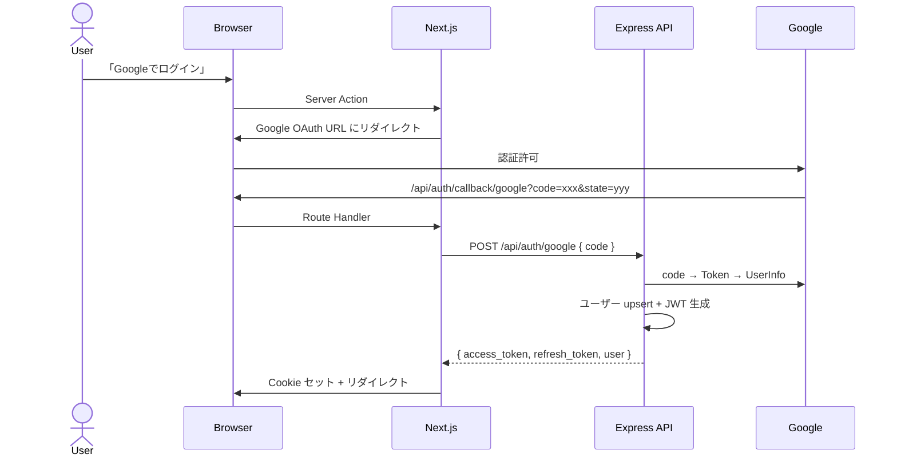

# 認証機能 設計書

## 目次

- [概要](#概要)
- [DB 設計](#db-設計)
- [API 設計](#api-設計)
- [UI 設計](#ui-設計)
  - [ログインページ（/sign-in）](#ログインページsign-in)
  - [オンボーディング（/onboarding）](#オンボーディングonboarding)
- [仕様詳細](#仕様詳細)
  - [Google OAuth フロー](#google-oauth-フロー)
  - [JWT トークン管理](#jwt-トークン管理)
  - [Next.js 側の認証管理](#nextjs-側の認証管理)
- [将来のプロバイダー拡張](#将来のプロバイダー拡張)
- [フロー図](#フロー図)
- [注意事項](#注意事項)

---

## 概要

- Google OAuth 2.0 でのログイン / サインアップ
- JWT（Access Token 15分 + Refresh Token 7日）によるセッション管理
- 初回ログイン時にプロフィール設定（オンボーディング）画面へ誘導
- 将来的に TikTok / X / Instagram OAuth を追加

---

## DB 設計

既存テーブルの拡張のみ。詳細は [common/README.md](../common/README.md) を参照。

- `users`: `bio`（text）と `is_onboarded`（boolean）を追加
- `auth_accounts`: 変更なし（既存のまま利用）

---

## API 設計

| メソッド | パス | 認証 | 説明 |
|---------|------|------|------|
| POST | `/api/auth/google` | 不要 | Google OAuth 認証コードを検証し、ユーザー作成/更新 + JWT 発行 |
| POST | `/api/auth/refresh` | Refresh Token | 新しい Access Token + Refresh Token を発行（ローテーション） |
| POST | `/api/auth/logout` | Access Token | Refresh Token を無効化 |
| GET | `/api/auth/me` | Access Token | ログイン中のユーザー情報を返却 |
| PUT | `/api/users/:id` | Access Token | プロフィール更新（name, bio, avatar_url）。初回は `is_onboarded` → true |

---

## UI 設計

### ログインページ（/sign-in）

immersive モード（ナビバー・サイドバーなしの完全フルスクリーン）。横長の 2 カラムレイアウトで、左にブランドエリア、右にサインインカードを配置する。

```
┌──────────────────────────────────────────────────────────────────┐
│  ┌─グリッドパターン背景─────────────────────────────────────┐  │
│  │  ⊙floating orb        ⊙floating orb                       │  │
│  │                                                            │  │
│  │  [⚡]                       ┌─グラデ枠カード─────────┐  │  │
│  │  SNS Battle                │  サインイン              │  │  │
│  │  リアルタイムで、つながる。  │  アカウントに接続        │  │  │
│  │  ライブ配信、1対1マッチング │                          │  │  │
│  │  バトル。新しい出会いが、    │  [G] Google でサインイン │  │  │
│  │  ここから始まる。           │  [T] TikTok（準備中）    │  │  │
│  │                            │  [X] X（準備中）         │  │  │
│  │  [🎥 ライブ配信]            │  [I] Instagram（準備中） │  │  │
│  │  [🤝 マッチング]            │                          │  │  │
│  │  [⚔️ バトル]                │  ─── その他 ───          │  │  │
│  │                            │  ゲストとして見学する     │  │  │
│  │   ⊙floating orb            │  利用規約・プライバシー    │  │  │
│  │                            └──────────────────────────┘  │  │
│  └────────────────────────────────────────────────────────────┘  │
└──────────────────────────────────────────────────────────────────┘
```

#### レイアウト

- **コンテナ**: `min-h-screen` で中央配置、`overflow-hidden` で背景装飾をクリップ
- **背景**:
  1. **グリッドパターン**: `bg-grid-pattern` クラス。`opacity-20`、`pointer-events-none`、`absolute inset-0`
  2. **フローティングオーブ**: 5 個の `motion.div`。それぞれ異なる位置・サイズ・色（パープル系 3 + シアン系 2）の放射グラデ円を配置
     - 例: `{ x: "15%", y: "20%", size: 400, blur: 100, color: "rgba(203,172,249,0.08)", delay: 0 }`
     - アニメーション: `x: [0, 30, -20, 0]`, `y: [0, -40, 20, 0]` を 20 秒で `easeInOut`、`repeat: Infinity, repeatType: "mirror"`
- **メインコンテンツ**: `flex w-full max-w-5xl items-center justify-between gap-16 px-8`
- **左ブランドエリア**（`lg:` 以上で表示、それ未満は非表示）:
  - **ロゴアイコン**: 80px 角丸正方形（`rounded-3xl`）。背景 `linear-gradient(135deg, rgba(203,172,249,0.3), rgba(14,165,233,0.3))` + 強グロー `box-shadow: 0 0 40px rgba(203,172,249,0.15), 0 0 80px rgba(14,165,233,0.1)`。中身に `⚡` 絵文字（30px）
    - アニメ: 初回 spring で `scale: 0 → 1`、その後 `rotate: [0, 5, -5, 0]` を 4 秒ループ
  - **タイトル**: `text-5xl font-bold`「SNS」+ グラデ「 Battle」（`from-primary via-cyan to-accent-pink` を `bg-clip-text text-transparent`）
  - **サブテキスト**: 3 行のキャッチコピー（`text-lg leading-relaxed text-text-muted`）
  - **フィーチャーバッジ**: `🎥 ライブ配信` `🤝 マッチング` `⚔️ バトル` を pill 形状で並べる。順次フェードイン（`delay: 0.8 + i * 0.15`）
- **右サインインカード**:
  - 外枠: `rounded-3xl p-[1px]` + グラデ背景（`linear-gradient(135deg, rgba(203,172,249,0.2), rgba(14,165,233,0.15), rgba(236,72,153,0.1))`）で 1px のカラフル枠を演出
  - 内側: `rounded-3xl px-8 py-10`、背景は深紺グラデ + `backdrop-filter: blur(40px)`
  - **モバイル時のみ**: 上部に小さなロゴ + タイトル + サブテキストを表示
  - **デスクトップ時のみ**: カードタイトル「サインイン」「アカウントに接続して始めましょう」
  - **OAuth ボタン群**（4 個、順次スライドイン `x: -20 → 0`）:
    - 各ボタン: 高さ約 56px。左に 32px の四角アイコンボックス + 右に「{プロバイダー} でサインイン」テキスト + ホバー時に右矢印 →
    - **enabled（Google のみ）**: 背景 `rgba(255,255,255,0.06)` + 1px 白枠、文字白。アイコンは白背景に濃グレーの「G」。ホバーで `box-shadow: 0 0 20px rgba(203,172,249,0.1)`、矢印が右に `translate-x-1`
    - **disabled（TikTok / X / Instagram）**: 背景 `rgba(255,255,255,0.02)` + 1px 薄枠、文字 `text-text-disabled`、`cursor-not-allowed`。テキストに「（準備中）」付与
  - **区切り線**: `h-[1px] flex-1 bg-white/[0.06]` を左右に、中央に「その他のオプション」テキスト
  - **ゲストボタン**: 全幅、`border: 1px dashed rgba(255,255,255,0.08)`、文字 `text-text-muted`、ホバーで白文字に
  - **フッター**: `text-xs leading-relaxed text-text-disabled`「サインインすることで、利用規約 と プライバシーポリシー に同意したものとみなされます。」

#### プロバイダー定義

| ID | 名前 | アイコン文字 | アイコン背景色 | enabled |
|----|------|-------------|---------------|---------|
| `google` | Google | `G` | `#4285F4` | true |
| `tiktok` | TikTok | `T` | `#000000` | false |
| `twitter` | X | `X` | `#1DA1F2` | false |
| `instagram` | Instagram | `I` | `#E4405F` | false |

`enabled: false` の場合、サインイン処理は実行せず disabled 状態で表示する。将来のプロバイダー追加時に `enabled: true` に切替えるだけで対応できる構造にする。

### オンボーディング（/onboarding）

初回ログイン後（`is_onboarded = false`）に遷移する。詳細は [profile/README.md](../profile/README.md) を参照。

- アバタープレビュー（Google 画像デフォルト）
- 表示名 *（必須）
- 自己紹介
- 生年月日 *（必須、18歳以上）
- 性別 *（必須、MALE / FEMALE / OTHER のラジオ）
- 「はじめる」パープルグラデボタン

---

## 仕様詳細

### Google OAuth フロー

1. `/sign-in` で「Googleでログイン」クリック
2. Next.js Server Action → Google OAuth URL 生成（`state` を Cookie に保存し CSRF 対策）
3. Google 認証画面 → 認証許可 → コールバック URL にリダイレクト
4. Next.js Route Handler (`/api/auth/callback/google`) → `state` 照合 → Express API 呼び出し
5. Express API: Google Token → UserInfo → ユーザー upsert + `streams` レコード作成 + JWT 生成
6. Next.js: JWT を HttpOnly Cookie にセット → `is_onboarded` で遷移先を判定

### JWT トークン管理

| トークン | 有効期限 | Cookie 名 | 設定 |
|---------|---------|-----------|------|
| Access Token | 15分 | `sb_access_token` | HttpOnly, Secure, SameSite=Strict |
| Refresh Token | 7日 | `sb_refresh_token` | HttpOnly, Secure, SameSite=Strict |

### Next.js 側の認証管理

- **Server Component**: `cookies()` から Access Token 取得 → Express API `/api/auth/me`
- **ミドルウェア**: Access Token 期限切れ時に Refresh Token で自動リフレッシュ
- **AuthProvider Context**: Server Layout → Client Component に user を共有

---

## 将来のプロバイダー拡張

| プロバイダー | 対応予定 |
|-------------|---------|
| TikTok | TikTok Login Kit |
| X (Twitter) | OAuth 2.0 |
| Instagram | Instagram Basic Display API |

同一メールアドレスの場合、既存ユーザーに `auth_accounts` を追加紐付け。

---

## フロー図



---

## 注意事項

- CSRF: `state` パラメータを Cookie に保存し照合
- XSS: JWT は HttpOnly Cookie（JavaScript からアクセス不可）
- Token Rotation: Refresh Token は1回使用で無効化
- 同時リフレッシュ: 短いグレース期間（10秒）を設ける
