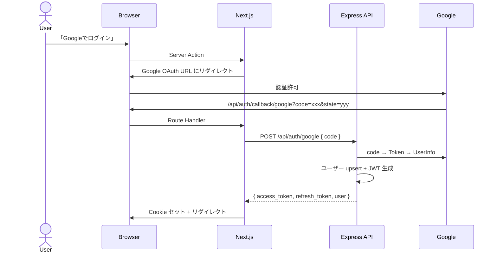

# 認証機能 設計書

## 目次

- [概要](#概要)
- [DB 設計](#db-設計)
- [API 設計](#api-設計)
- [UI 設計](#ui-設計)
  - [ログインページ（/sign-in）](#ログインページsign-in)
  - [オンボーディング（/onboarding）](#オンボーディングonboarding)
- [仕様詳細](#仕様詳細)
  - [Google OAuth フロー](#google-oauth-フロー)
  - [JWT トークン管理](#jwt-トークン管理)
  - [Next.js 側の認証管理](#nextjs-側の認証管理)
- [将来のプロバイダー拡張](#将来のプロバイダー拡張)
- [フロー図](#フロー図)
- [注意事項](#注意事項)

---

## 概要

- Google OAuth 2.0 でのログイン / サインアップ
- JWT（Access Token 15分 + Refresh Token 7日）によるセッション管理
- 初回ログイン時にプロフィール設定（オンボーディング）画面へ誘導
- 将来的に TikTok / X / Instagram OAuth を追加

---

## DB 設計

既存テーブルの拡張のみ。詳細は [common/README.md](../common/README.md) を参照。

- `users`: `bio`（text）と `is_onboarded`（boolean）を追加
- `auth_accounts`: 変更なし（既存のまま利用）

---

## API 設計

| メソッド | パス | 認証 | 説明 |
|---------|------|------|------|
| POST | `/api/auth/google` | 不要 | Google OAuth 認証コードを検証し、ユーザー作成/更新 + JWT 発行 |
| POST | `/api/auth/refresh` | Refresh Token | 新しい Access Token + Refresh Token を発行（ローテーション） |
| POST | `/api/auth/logout` | Access Token | Refresh Token を無効化 |
| GET | `/api/auth/me` | Access Token | ログイン中のユーザー情報を返却 |
| PUT | `/api/users/:id` | Access Token | プロフィール更新（name, bio, avatar_url）。初回は `is_onboarded` → true |

---

## UI 設計

### ログインページ（/sign-in）

```
┌─────────────────────────────────────────┐
│           [SNS Battle Logo]             │
│        リアルタイムで、つながる。         │
│                                         │
│    [G] Googleでログイン                  │
│    [T] TikTokでログイン    Coming Soon   │
│    [X] Xでログイン         Coming Soon   │
│    [I] Instagramでログイン Coming Soon   │
└─────────────────────────────────────────┘
```

- 背景: `#0e0e10` + パープルグラデーション光彩
- Coming Soon ボタン: `#2d2d35` 背景、グレーアウト

### オンボーディング（/onboarding）

- アバタープレビュー（Google 画像デフォルト）+ 表示名 + 自己紹介
- 「はじめる」パープルボタン

---

## 仕様詳細

### Google OAuth フロー

1. `/sign-in` で「Googleでログイン」クリック
2. Next.js Server Action → Google OAuth URL 生成（`state` を Cookie に保存し CSRF 対策）
3. Google 認証画面 → 認証許可 → コールバック URL にリダイレクト
4. Next.js Route Handler (`/api/auth/callback/google`) → `state` 照合 → Express API 呼び出し
5. Express API: Google Token → UserInfo → ユーザー upsert + `streams` レコード作成 + JWT 生成
6. Next.js: JWT を HttpOnly Cookie にセット → `is_onboarded` で遷移先を判定

### JWT トークン管理

| トークン | 有効期限 | Cookie 名 | 設定 |
|---------|---------|-----------|------|
| Access Token | 15分 | `sb_access_token` | HttpOnly, Secure, SameSite=Strict |
| Refresh Token | 7日 | `sb_refresh_token` | HttpOnly, Secure, SameSite=Strict |

### Next.js 側の認証管理

- **Server Component**: `cookies()` から Access Token 取得 → Express API `/api/auth/me`
- **ミドルウェア**: Access Token 期限切れ時に Refresh Token で自動リフレッシュ
- **AuthProvider Context**: Server Layout → Client Component に user を共有

---

## 将来のプロバイダー拡張

| プロバイダー | 対応予定 |
|-------------|---------|
| TikTok | TikTok Login Kit |
| X (Twitter) | OAuth 2.0 |
| Instagram | Instagram Basic Display API |

同一メールアドレスの場合、既存ユーザーに `auth_accounts` を追加紐付け。

---

## フロー図



---

## 注意事項

- CSRF: `state` パラメータを Cookie に保存し照合
- XSS: JWT は HttpOnly Cookie（JavaScript からアクセス不可）
- Token Rotation: Refresh Token は1回使用で無効化
- 同時リフレッシュ: 短いグレース期間（10秒）を設ける
