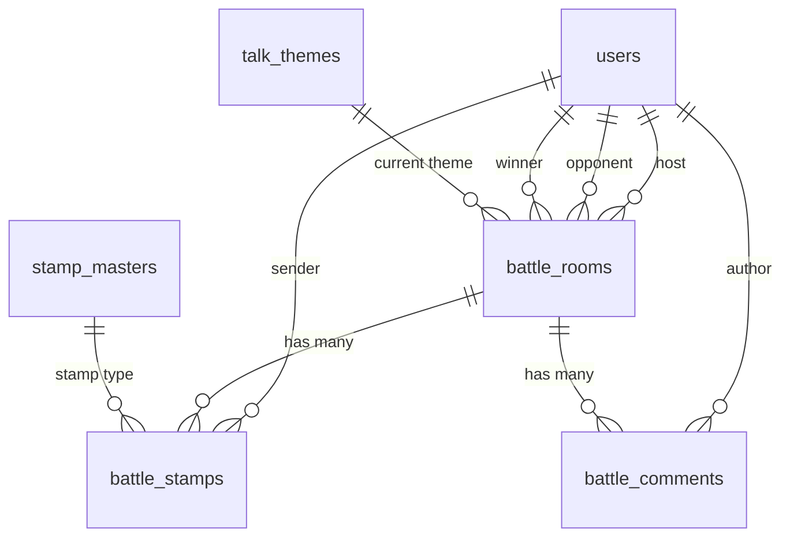
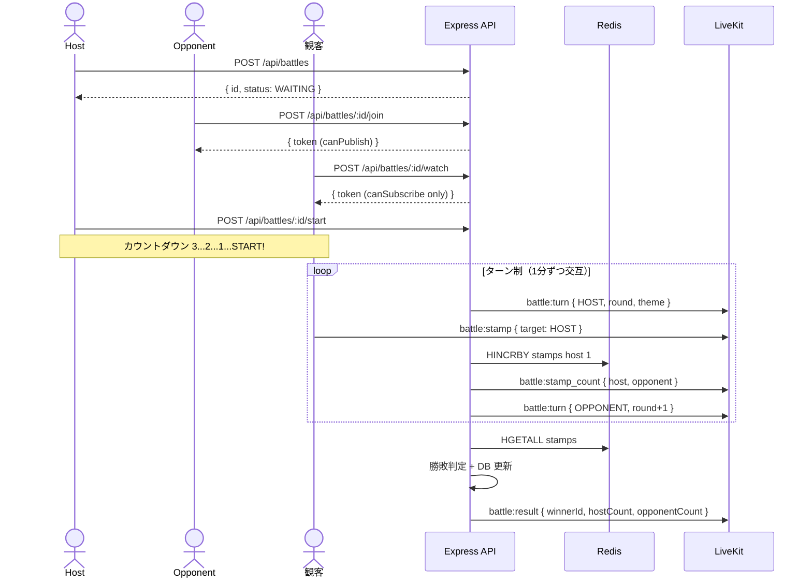

# SNS Battle 機能（1対1 + 観客）設計書

## 目次

- [概要](#概要)
- [機能一覧](#機能一覧)
- [DB 設計](#db-設計)
  - [ER 図](#er-図)
  - [battle_rooms](#battle_rooms)
  - [battle_stamps](#battle_stamps)
  - [battle_comments](#battle_comments)
- [API 設計](#api-設計)
  - [REST API](#rest-api)
  - [LiveKit Data Channel イベント](#livekit-data-channel-イベント)
  - [Admin API](#admin-api)
- [UI 設計](#ui-設計)
  - [画面一覧](#画面一覧)
  - [バトル一覧（/battles）](#バトル一覧battles)
  - [バトル作成（/battles/create）](#バトル作成battlescreate)
  - [バトルルーム（/battles/:id）](#バトルルームbattlesid)
  - [バトル結果（/battles/:id/result）](#バトル結果battlesidresult)
- [仕様詳細](#仕様詳細)
  - [バトルルーム作成](#バトルルーム作成)
  - [対戦相手参加](#対戦相手参加)
  - [観客参加](#観客参加)
  - [バトル開始フロー](#バトル開始フロー)
  - [ターン制トーク](#ターン制トーク)
  - [バトルトークテーマ](#バトルトークテーマ)
  - [スタンプ対決](#スタンプ対決)
  - [勝敗判定](#勝敗判定)
  - [観客コメント](#観客コメント)
  - [バトル終了](#バトル終了)
- [ターン管理の実装](#ターン管理の実装)
- [スタンプカウントの実装](#スタンプカウントの実装)
- [フロー図](#フロー図)
- [注意事項](#注意事項)

---

## 概要

1対1の対戦形式で、観客も参加できるバトル機能。2人の対戦者が交互にトークし、観客がスタンプで応援。スタンプ数の多い方が勝利する。

**参加者構成**:
- ホスト（作成者）: 1名（Publish + Subscribe + DataPublish）
- 対戦相手: 1名（Publish + Subscribe + DataPublish）
- 観客: N名（Subscribe + DataPublish のみ）

**LiveKit Room**: `battle:{roomId}`

---

## 機能一覧

| 機能 | 詳細 |
|------|------|
| バトル作成 | ルーム作成し対戦相手を待機 |
| 対戦相手参加 | 対戦相手がルームに参加 |
| 観戦参加 | 観客としてバトルを視聴 |
| カウントダウン | 3, 2, 1, START! 表示 |
| ターン制トーク | 1分ずつ交互にトーク。マイク自動ミュート切替 |
| トークテーマ | バトル用テーマを表示 |
| スタンプ対決 | 観客がスタンプ送信。各プレイヤーへのスタンプ数をリアルタイム集計 |
| 勝敗判定 | スタンプ数の多い方が勝利 |
| 観客コメント | 観客がコメント送信 |

---

## DB 設計

### ER 図



### battle_rooms

| カラム | 型 | 制約 | 説明 |
|--------|------|------|------|
| id | int | PK, auto_increment | バトルルームID |
| host_id | int | FK → users, NOT NULL | ホスト（作成者） |
| opponent_id | int | FK → users, nullable | 対戦相手（参加前は null） |
| title | varchar(255) | NOT NULL | バトルタイトル |
| livekit_room_name | varchar(255) | unique, NOT NULL | LiveKit ルーム名 |
| status | BattleStatus | NOT NULL, default: WAITING | WAITING / COUNTDOWN / ACTIVE / ENDED |
| current_turn | BattleTurn | nullable | HOST / OPPONENT |
| current_round | int | NOT NULL, default: 0 | 現在のラウンド番号 |
| theme_id | int | FK → talk_themes, nullable | 現在のトークテーマ |
| host_stamp_count | int | NOT NULL, default: 0 | ホストへのスタンプ数（終了時に永続化） |
| opponent_stamp_count | int | NOT NULL, default: 0 | 対戦相手へのスタンプ数（終了時に永続化） |
| winner_id | int | FK → users, nullable | 勝者（終了後に設定。引き分けは null） |
| started_at | timestamp | nullable | バトル開始日時 |
| ended_at | timestamp | nullable | バトル終了日時 |
| created_at | timestamp | NOT NULL | 作成日時 |
| updated_at | timestamp | NOT NULL | 更新日時 |

インデックス: `livekit_room_name`(unique), `status`, `host_id`

### battle_stamps

観客のスタンプ送信ログ。リアルタイムカウントは Redis。DB にはバトル終了時にバッチ保存。

| カラム | 型 | 制約 | 説明 |
|--------|------|------|------|
| id | int | PK, auto_increment | スタンプログID |
| battle_room_id | int | FK → battle_rooms, NOT NULL | バトルルームID |
| user_id | int | FK → users, NOT NULL | 送信者（観客） |
| target | BattleStampTarget | NOT NULL | HOST / OPPONENT |
| stamp_id | int | FK → stamp_masters, NOT NULL | スタンプ種別 |
| created_at | timestamp | NOT NULL | 送信日時 |

インデックス: `(battle_room_id, target)`

### battle_comments

観客のコメントログ。非同期バッチ保存（10秒間隔）。

| カラム | 型 | 制約 | 説明 |
|--------|------|------|------|
| id | int | PK, auto_increment | コメントID |
| battle_room_id | int | FK → battle_rooms, NOT NULL | バトルルームID |
| user_id | int | FK → users, NOT NULL | コメント投稿者 |
| body | text | NOT NULL | コメント本文 |
| created_at | timestamp | NOT NULL | 投稿日時 |

インデックス: `(battle_room_id, created_at)`

### Enum 定義

```typescript
enum BattleStatus { WAITING, COUNTDOWN, ACTIVE, ENDED }
enum BattleTurn { HOST, OPPONENT }
enum BattleStampTarget { HOST, OPPONENT }
```

---

## API 設計

### REST API

| メソッド | パス | 認証 | 説明 |
|---------|------|------|------|
| GET | `/api/battles` | 不要 | バトルルーム一覧を取得する。`status` クエリで WAITING / ACTIVE をフィルタ可能。カーソルページネーション |
| POST | `/api/battles` | Access Token | バトルルームを新規作成する。タイトルを指定。ステータス WAITING で対戦相手を待機 |
| GET | `/api/battles/:id` | 不要 | バトル詳細（対戦者情報、ターン/ラウンド、テーマ、スタンプカウント、観客数）を取得する |
| POST | `/api/battles/:id/join` | Access Token | 対戦相手として参加する。LiveKit トークン（canPublish）を返却。WAITING のルームのみ |
| POST | `/api/battles/:id/watch` | Access Token | 観客として参加する。LiveKit トークン（canSubscribe + canPublishData のみ、canPublish なし）を返却 |
| POST | `/api/battles/:id/start` | Access Token | バトルを開始する。ホストのみ。対戦相手が参加済みであること。COUNTDOWN → ACTIVE + タイマー開始 |
| POST | `/api/battles/:id/end` | Access Token | バトルを終了する。Redis スタンプカウントを DB に永続化 + 勝敗判定 |
| GET | `/api/battles/:id/result` | 不要 | バトル結果（勝者、両者スタンプ数、観客数、バトル時間）を取得する |
| GET | `/api/battles/:id/comments` | 不要 | コメント履歴を時系列で取得する。カーソルページネーション |

### LiveKit Data Channel イベント

| イベント名 | 方向 | モード | 説明 |
|-----------|------|--------|------|
| `battle:comment` | 観客 → Room | Reliable | 観客コメント送信。userId, userName, body, timestamp |
| `battle:stamp` | 観客 → Room | Lossy | 観客スタンプ送信。送信先（HOST/OPPONENT）指定付き |
| `battle:stamp_count` | Server → Room | Reliable | 1秒間隔で両者のスタンプ累計数をブロードキャスト |
| `battle:turn` | Server → Room | Reliable | 1分ごとのターン切替通知。currentTurn, roundNumber, themeTitle |
| `battle:result` | Server → Room | Reliable | バトル終了時に勝者ID、両者スタンプ数を全参加者に通知 |

### Admin API

| メソッド | パス | 説明 |
|---------|------|------|
| GET | `/api/admin/battles` | バトル一覧（全ステータス） |
| POST | `/api/admin/battles/:id/end` | バトルを管理者権限で強制終了 |

---

## UI 設計

### 画面一覧

| パス | 画面名 | 認証 |
|------|--------|------|
| `/battles` | バトル一覧 | 不要 |
| `/battles/create` | バトル作成 | 必要 |
| `/battles/:id` | バトルルーム（視聴/参加） | 不要（参加は要認証） |
| `/battles/:id/result` | バトル結果 | 不要 |

### バトル一覧（/battles）

```
┌─────────────────────────────────────────────┐
│ バトル一覧                    [バトル作成 +] │
│                                             │
│ 開催中 ⚔️                                   │
│ ┌─────────────────────────────────────────┐ │
│ │ きのこ vs たけのこ    🔴 LIVE           │ │
│ │ HostA ⚔️ OpponentB   👁 150人          │ │
│ │ 🏆 42 - 38            [観戦する]       │ │
│ └─────────────────────────────────────────┘ │
│                                             │
│ 対戦相手募集中 🕐                            │
│ ┌─────────────────────────────────────────┐ │
│ │ 夏 vs 冬              待機中            │ │
│ │ HostC ⚔️ ???          [参加する]        │ │
│ └─────────────────────────────────────────┘ │
└─────────────────────────────────────────────┘
```

タブ: 「すべて」「開催中」「募集中」

### バトル作成（/battles/create）

タイトル入力フィールド + 「バトルを作成する」ボタン

### バトルルーム（/battles/:id）

```
┌──────────────────────────────────────────┬──────────────┐
│ きのこ vs たけのこ   🔴 LIVE              │ コメント 💬  │
│                                          │              │
│ ┌──────────────┐  ⚔️  ┌──────────────┐  │ User: がんば │
│ │  HostA 映像  │  VS  │ OpponentB映像│  │ User: きのこ │
│ │  🎤 話し中   │      │  🔇 待機中   │  │ 🔥🔥        │
│ └──────────────┘      └──────────────┘  │              │
│                                          │ ────────────│
│ テーマ: きのこの山 vs たけのこの里         │ [メッセージ] │
│ 🔄 HostA のターン（残り 0:42）            │ [😀] [送信]  │
│                                          │ ────────────│
│ ┌──────────────────────────────────────┐ │  スタンプ    │
│ │ HostA  [=========  42  ] 53%         │ │ [HostAに送る]│
│ │ OpptB  [=======  38  ] 47%           │ │ [OpptBに送る]│
│ └──────────────────────────────────────┘ │ [🎯 パレット]│
│                                          │              │
│ 👁 150人が観戦中                          │              │
└──────────────────────────────────────────┴──────────────┘
```

- **左右分割**: 対戦者ビデオを VS レイアウトで配置
- **ターン表示**: 話し中プレイヤーに緑ボーダー、相手はミュートアイコン + 半透明
- **トークテーマ**: ビデオ下にテーマタイトル表示
- **スタンプカウント**: プログレスバー（Host: パープル / Opponent: ホットピンク）
- **チャットサイドバー**: 右側。コメント + スタンプ送信先選択

### バトル結果（/battles/:id/result）

```
┌─────────────────────────────────────────┐
│           🏆 バトル結果                  │
│    [Avatar A]        [Avatar B]         │
│     HostA             OpponentB         │
│      42 🏆   VS   38                   │
│     WIN!            LOSE               │
│    観客数: 150人 / バトル時間: 10:00     │
│    [ホームに戻る]  [もう一度バトル]      │
└─────────────────────────────────────────┘
```

勝者に冠アイコン + 紙吹雪。敗者はグレーアウト。

---

## 仕様詳細

### バトルルーム作成

1. `/battles/create` でタイトル入力 → `POST /api/battles`
2. `battle_rooms` 作成（status: WAITING、LiveKit Room: `battle:{roomId}`）
3. `/battles/:id` にリダイレクト → 対戦相手待機

### 対戦相手参加

1. バトル一覧 or リンクから `/battles/:id` にアクセス
2. 「参加する」→ `POST /api/battles/:id/join` → `opponent_id` 設定 + トークン取得

### 観客参加

1. `/battles/:id` アクセス（ACTIVE 状態）
2. `POST /api/battles/:id/watch` → トークン取得（canSubscribe + canPublishData のみ）
3. 対戦者のビデオ/音声を受信

### バトル開始フロー

1. ホストが「バトル開始」クリック → `POST /api/battles/:id/start`
2. COUNTDOWN → カウントダウンオーバーレイ（全参加者に表示）
3. 完了後 → ACTIVE、`current_turn=HOST`、`current_round=1`、最初のテーマ選択

### ターン制トーク

| ラウンド | 時間 | ターン |
|---------|------|--------|
| 1 | 0:00〜1:00 | HOST |
| 2 | 1:00〜2:00 | OPPONENT |
| 3 | 2:00〜3:00 | HOST |
| ... | 交互に繰り返し | ... |

- 話していない側のマイクをクライアントサイドで自動ミュート
- 現在のターンのビデオに緑ボーダー
- `battle:turn` イベントで全参加者に通知

### バトルトークテーマ

- BATTLE カテゴリのテーマをランダム選択
- 2ターン（2分）ごとに新テーマ表示
- `battle:turn` イベントに `themeTitle` を含めて送信

### スタンプ対決

**送信フロー**:
1. 観客がスタンプパレットを開く
2. 送信先（HOST / OPPONENT）を選択
3. スタンプ選択 → Data Channel（Lossy）で送信
4. Redis `HINCRBY battle:{roomId}:stamps {target} 1`
5. 1秒間隔で `battle:stamp_count` を全参加者にブロードキャスト

**制約**: 未ログイン不可、対戦者自身は送信不可、レート制限1秒3回

### 勝敗判定

| 条件 | 結果 |
|------|------|
| host_stamp_count > opponent_stamp_count | HOST の勝利 |
| opponent_stamp_count > host_stamp_count | OPPONENT の勝利 |
| 同数 | 引き分け（winner_id = null） |

### 観客コメント

Data Channel（Reliable）で送信。配信機能のチャットと同仕様。

### バトル終了

**終了トリガー**: 全ラウンド完了（最大10ラウンド=10分）/ ホスト手動終了 / 対戦者離脱 / Admin 強制終了

**終了処理**:
1. `status` → ENDED、`ended_at` 記録
2. Redis スタンプカウント → DB 永続化
3. 勝敗判定 → `winner_id` 設定
4. `battle:result` で全参加者に通知
5. LiveKit Room 閉じる
6. `/battles/:id/result` にリダイレクト

---

## ターン管理の実装

```
Express API: BattleTimerService

バトル開始時:
  1. Redis: battle:state:{roomId} = { currentTurn, currentRound, turnStartedAt, themes[] }
  2. setInterval (1秒ごと):
     - 60秒経過でターン切替 (HOST ↔ OPPONENT)
     - 2ラウンドごとにテーマ切替
     - battle:turn を Data Channel で送信
  3. 全ラウンド完了 → 終了処理
```

---

## スタンプカウントの実装

```
Redis:
  battle:{roomId}:stamps (Hash) → { host: 42, opponent: 38 }

スタンプ受信:
  HINCRBY battle:{roomId}:stamps {target} 1

1秒間隔:
  HGETALL → battle:stamp_count をブロードキャスト

バトル終了時:
  HGETALL → battle_rooms.host_stamp_count, opponent_stamp_count を UPDATE
  battle_stamps にバッチ INSERT
  DEL battle:{roomId}:stamps
```

---

## フロー図



---

## 注意事項

### セキュリティ
- 観客には canPublish を絶対に付与しない（ビデオ/音声配信不可）
- 対戦者自身は自分にスタンプを送れない
- ホストのみバトル開始/終了が可能
- ブロック済みユーザーのルーム参加を拒否

### パフォーマンス
- スタンプカウントは Redis 管理（DB は終了時のみ）
- カウント更新は1秒間隔バッチ送信
- スタンプアニメーション同時表示上限30個

### エッジケース
- 対戦相手参加前にホスト離脱: ルーム自動削除
- バトル中に対戦者離脱: 残った対戦者の勝利
- 0対0: 引き分け
- 観客0人: スタンプ0で引き分け
- サーバー再起動: Redis からバトル状態を復元
