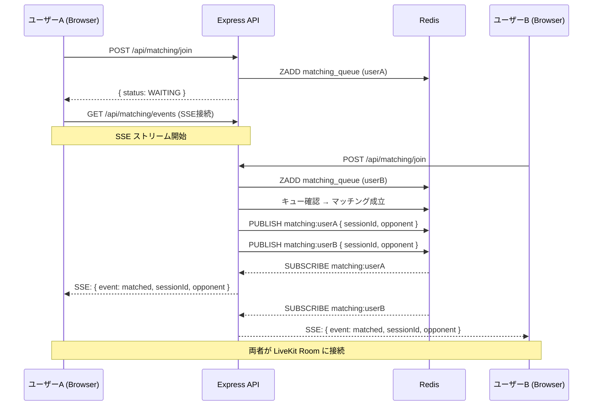
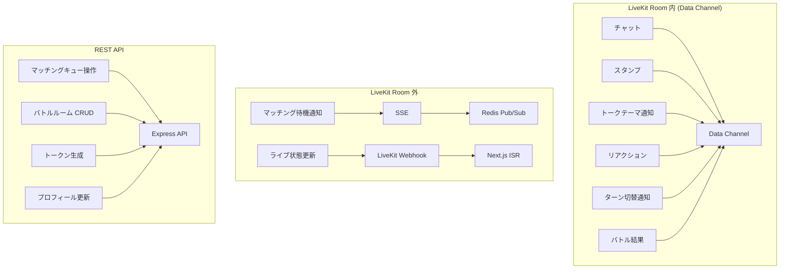

# インフラ設計

## 目次

- [全体アーキテクチャ図](#全体アーキテクチャ図)
- [コンポーネント一覧](#コンポーネント一覧)
- [AWS 構成](#aws-構成)
  - [ネットワーク（VPC）](#ネットワークvpc)
  - [コンピュート（ECS Fargate）](#コンピュートecs-fargate)
  - [データベース（RDS）](#データベースrds)
  - [キャッシュ（ElastiCache）](#キャッシュelasticache)
  - [ストレージ（S3 + CloudFront）](#ストレージs3--cloudfront)
  - [ロードバランサー（ALB）](#ロードバランサーalb)
  - [DNS（Route 53）](#dnsroute-53)
- [LiveKit サーバー](#livekit-サーバー)
  - [LiveKit Cloud vs Self-hosted](#livekit-cloud-vs-self-hosted)
  - [LiveKit Cloud 構成](#livekit-cloud-構成)
  - [将来の Self-hosted 移行プラン](#将来の-self-hosted-移行プラン)
- [リアルタイム通信設計](#リアルタイム通信設計)
  - [WebSocket サーバーは不要](#websocket-サーバーは不要)
  - [LiveKit Data Channel によるリアルタイム通信](#livekit-data-channel-によるリアルタイム通信)
  - [LiveKit Room 外のリアルタイム通信](#livekit-room-外のリアルタイム通信)
  - [通信フロー図](#通信フロー図)
- [マッチングキューの設計](#マッチングキューの設計)
- [環境構成](#環境構成)
- [CI/CD](#cicd)
- [監視・ログ](#監視ログ)
- [セキュリティ](#セキュリティ)
- [コスト見積もり（開発環境）](#コスト見積もり開発環境)

---

## 全体アーキテクチャ図

```
                            ┌──────────────┐
                            │   Route 53   │
                            │  (DNS)       │
                            └──────┬───────┘
                                   │
                            ┌──────▼───────┐
                            │  CloudFront  │
                            │  (CDN)       │
                            └──────┬───────┘
                                   │
                    ┌──────────────┼──────────────┐
                    │              │              │
             ┌──────▼──────┐ ┌────▼─────┐ ┌──────▼──────┐
             │   S3        │ │   ALB    │ │  LiveKit    │
             │ (静的資産)   │ │          │ │  Cloud      │
             └─────────────┘ └────┬─────┘ └──────┬──────┘
                                  │              │
                    ┌─────────────┼─────────┐    │
                    │             │         │    │
             ┌──────▼──────┐ ┌───▼────┐    │    │
             │  ECS Task   │ │ECS Task│    │    │
             │  (Next.js   │ │(Express│    │    │
             │   Web)      │ │ API)   │◄───┼────┘
             └─────────────┘ └───┬────┘    │  Webhook
                                 │         │
                    ┌────────────┼─────────┤
                    │            │         │
             ┌──────▼──────┐ ┌──▼────┐    │
             │    RDS      │ │Redis  │    │
             │ PostgreSQL  │ │(Elasti│    │
             │             │ │Cache) │    │
             └─────────────┘ └───────┘    │
                                          │
                                   ┌──────▼──────┐
                                   │  Browser    │
                                   │ (WebRTC +   │
                                   │  Data Ch.)  │
                                   └─────────────┘
```

---

## コンポーネント一覧

| コンポーネント | サービス | 役割 |
|---------------|---------|------|
| Web フロントエンド | ECS Fargate (Next.js) | SSR/SSG、Server Actions、Route Handler |
| API サーバー | ECS Fargate (Express) | REST API、LiveKit トークン生成、Webhook 受信 |
| メインDB | RDS PostgreSQL 16 | ユーザー、配信、バトル等のデータ永続化 |
| キャッシュ/キュー | ElastiCache Redis 7 | マッチングキュー、スタンプカウント、セッション |
| 静的資産 | S3 + CloudFront | スタンプ画像、サムネイル、アバター |
| メディアサーバー | LiveKit Cloud | WebRTC SFU、ビデオ/音声配信、Data Channel |
| DNS | Route 53 | ドメイン管理 |
| CDN | CloudFront | 静的資産配信、SSL 終端 |
| ロードバランサー | ALB | ECS タスクへのトラフィック分散 |

---

## AWS 構成

### ネットワーク（VPC）

```
VPC (10.0.0.0/16)
├── Public Subnet A (10.0.1.0/24)  ← ALB, NAT Gateway
├── Public Subnet C (10.0.2.0/24)  ← ALB (Multi-AZ)
├── Private Subnet A (10.0.10.0/24) ← ECS Tasks
├── Private Subnet C (10.0.11.0/24) ← ECS Tasks (Multi-AZ)
├── Isolated Subnet A (10.0.20.0/24) ← RDS, ElastiCache
└── Isolated Subnet C (10.0.21.0/24) ← RDS, ElastiCache (Multi-AZ)
```

- ECS タスクは Private Subnet に配置（NAT Gateway 経由でインターネットアクセス）
- RDS / ElastiCache は Isolated Subnet に配置（インターネットアクセスなし）
- ALB は Public Subnet に配置

### コンピュート（ECS Fargate）

| サービス | CPU | メモリ | タスク数 | ポート |
|---------|-----|--------|---------|--------|
| Next.js Web | 512 | 1024MB | 2（最小） | 3000 |
| Express API | 512 | 1024MB | 2（最小） | 8080 |

- Fargate Spot を開発環境で利用（コスト削減）
- オートスケーリング: CPU 70% でスケールアウト

### データベース（RDS）

| 項目 | 設定 |
|------|------|
| エンジン | PostgreSQL 16 |
| インスタンスクラス | db.t4g.micro（開発） / db.r6g.large（本番） |
| Multi-AZ | 開発: なし / 本番: あり |
| ストレージ | gp3, 20GB（自動拡張有効） |
| バックアップ | 7日間保持 |

### キャッシュ（ElastiCache）

| 項目 | 設定 |
|------|------|
| エンジン | Redis 7 |
| ノードタイプ | cache.t4g.micro（開発） / cache.r6g.large（本番） |
| クラスターモード | 開発: 無効 / 本番: 有効 |

**Redis の用途**:
- マッチングキュー（Sorted Set + Pub/Sub）
- バトルのスタンプカウント（Hash でリアルタイムインクリメント）
- セッション管理（マッチング/バトルのアクティブセッション追跡）
- レート制限（スタンプ送信の throttle）

### ストレージ（S3 + CloudFront）

| バケット | 用途 |
|---------|------|
| `sns-battle-assets-{env}` | スタンプ画像、ユーザーアバター、配信サムネイル |
| `sns-battle-uploads-{env}` | 一時アップロード（署名付き URL で直接アップロード） |

- CloudFront で CDN 配信（TTL: 1日）
- S3 署名付き URL でクライアント直接アップロード（API サーバーを経由しない）

### ロードバランサー（ALB）

| リスナー | ルーティング |
|---------|------------|
| HTTPS:443 | `/api/*` → Express API TG / それ以外 → Next.js Web TG |

- SSL 証明書は ACM で管理
- ヘルスチェック: `/api/health`（API）、`/`（Web）

### DNS（Route 53）

| レコード | 値 |
|---------|-----|
| `snsbattle.com` | CloudFront Distribution |
| `api.snsbattle.com` | ALB（将来分離時） |

---

## LiveKit サーバー

### LiveKit Cloud vs Self-hosted

| 観点 | LiveKit Cloud | Self-hosted (AWS) |
|------|--------------|-------------------|
| 初期コスト | なし（無料枠あり） | 高（EC2/ECS + TURN サーバー構築） |
| 運用コスト | 従量課金 | インスタンスコスト（固定） |
| スケーリング | 自動 | 自前実装（オートスケーリンググループ） |
| 可用性 | SLA 99.99% | 自前で Multi-AZ 構成が必要 |
| リージョン | 東京リージョン利用可 | 任意 |
| 開発速度 | **速い**（設定のみ） | 遅い（構築・テスト・運用） |

### LiveKit Cloud 構成

**初期リリース（Phase 1〜5）では LiveKit Cloud を使用する**。

- 無料枠: 月 500 participant-minutes（開発・テストに十分）
- 東京リージョンのエッジサーバーで低遅延
- Webhook で API サーバーにイベント通知

**必要な環境変数**:
```
LIVEKIT_API_KEY=APIxxxxx
LIVEKIT_API_SECRET=xxxxx
LIVEKIT_URL=wss://sns-battle-xxxxx.livekit.cloud
LIVEKIT_WEBHOOK_SECRET=xxxxx
```

### 将来の Self-hosted 移行プラン

利用者数が増えて LiveKit Cloud のコストが月額 $500 を超えた場合、Self-hosted への移行を検討:

- AWS ECS/EC2 に LiveKit サーバーをデプロイ
- TURN サーバー（coturn）を別途構築
- Redis を LiveKit のルーム状態管理に共有
- Terraform モジュールとして `packages/terraform/aws/modules/livekit/` に定義

---

## リアルタイム通信設計

### WebSocket サーバーは不要

**自前の WebSocket サーバーは構築しない**。理由:

1. チャット・スタンプ・トークテーマ・リアクションなどのリアルタイムデータは、すべて「同じ LiveKit Room に接続しているユーザー間」でやり取り
2. ビデオ参加者 = データ受信者であり、別途 WebSocket 接続を管理する必要がない
3. LiveKit トークンで認証済みのユーザーのみがデータ送受信でき、セキュリティがシンプル
4. WebSocket サーバーの構築・スケーリング・障害対応が不要で、運用コストを削減

### LiveKit Data Channel によるリアルタイム通信

LiveKit の Data Channel は以下の2つのモードを提供:

| モード | 用途 | プロトコル |
|--------|------|-----------|
| Reliable | チャット、リアクション、テーマ通知 | TCP-like（再送あり） |
| Lossy | スタンプアニメーション | UDP-like（再送なし、低遅延） |

**各機能のデータフロー**:

#### 配信機能
```
視聴者 → [Data Channel: Reliable] → Room 全体
  - stream:comment { userId, userName, body, timestamp }
  - stream:stamp   { userId, stampId }  ← Lossy モード
```

#### マッチング機能
```
Server (API) → [Data Channel: Reliable] → Room (2名)
  - matching:theme    { themeId, title, choices[], roundNumber }
  - matching:timer    { remainingSeconds, canEnd }

User → [Data Channel: Reliable] → Room (2名)
  - matching:reaction { userId, choiceId, roundNumber }

Server → [Data Channel: Reliable] → Room (2名)
  - matching:reaction_match { matched: boolean, choiceId }
```

#### バトル機能
```
観客 → [Data Channel: Reliable] → Room 全体
  - battle:comment { userId, userName, body }
  - battle:stamp   { userId, stampId, target }  ← Lossy モード

Server → [Data Channel: Reliable] → Room 全体
  - battle:stamp_count { hostCount, opponentCount }
  - battle:turn        { currentTurn, roundNumber, themeTitle }
  - battle:result      { winnerId, hostCount, opponentCount }
```

### LiveKit Room 外のリアルタイム通信

LiveKit Room に接続する**前**に必要なリアルタイム通信:

| ユースケース | 方式 | 説明 |
|-------------|------|------|
| マッチング待機中の成立通知 | **SSE (Server-Sent Events)** | Express API から SSE エンドポイントを提供。Redis Pub/Sub でマッチング成立を受信し、SSE でクライアントに通知 |
| ホーム画面のライブ状態更新 | **ISR + revalidation** | LiveKit Webhook でDB更新 → Next.js の `revalidatePath()` / `revalidateTag()` でページ再生成 |

#### マッチング待機 SSE フロー



### 通信フロー図



---

## マッチングキューの設計

Redis を使用したマッチングキューの実装:

```
Redis データ構造:
- matching_queue (Sorted Set): score=timestamp, member=userId
- matching:session:{sessionId} (Hash): user1Id, user2Id, status, startedAt
- matching:{userId} (Pub/Sub channel): マッチング成立通知
```

**マッチングロジック**:
1. ユーザーがキューに参加 → `ZADD matching_queue {timestamp} {userId}`
2. キュー参加時に最も古い待機ユーザーを取得 → `ZRANGE matching_queue 0 0`
3. 自分以外のユーザーがいればマッチング成立
4. 両ユーザーをキューから削除 + セッション作成
5. Redis Pub/Sub で両ユーザーに通知

**排他制御**: `WATCH` + `MULTI/EXEC` でマッチングの競合を防止

---

## 環境構成

| 環境 | 用途 | インフラ |
|------|------|---------|
| local | 開発 | Docker Compose (PostgreSQL + Redis) + LiveKit Cloud (dev project) |
| dev | 開発検証 | AWS (最小構成) + LiveKit Cloud |
| staging | リリース前検証 | AWS (本番相当) + LiveKit Cloud |
| prod | 本番 | AWS (本番構成) + LiveKit Cloud (or Self-hosted) |

### ローカル開発環境

```yaml
# docker-compose.yaml に追加するサービスはなし
# 既存の PostgreSQL + Redis をそのまま利用
# LiveKit は Cloud の dev project を使用（ローカル実行不要）
```

---

## CI/CD

| ステージ | 内容 | ツール |
|---------|------|--------|
| Lint | ESLint + Prettier + tflint + trivy | GitHub Actions |
| Test | Jest (unit + integration) | GitHub Actions |
| Build | Docker イメージビルド | GitHub Actions + ECR |
| Deploy (dev) | ECS タスク定義更新 + サービス更新 | GitHub Actions + Terraform |
| Deploy (prod) | 承認フロー付きデプロイ | GitHub Actions + Terraform |

---

## 監視・ログ

| 対象 | ツール | 内容 |
|------|--------|------|
| アプリケーションログ | CloudWatch Logs | Express API / Next.js のログ集約 |
| メトリクス | CloudWatch Metrics | CPU/メモリ/リクエスト数/レイテンシ |
| アラート | CloudWatch Alarms + SNS | エラー率上昇、CPU 高負荷、ヘルスチェック失敗 |
| LiveKit メトリクス | LiveKit Cloud Dashboard | ルーム数、参加者数、帯域使用量 |
| APM | (将来) Datadog or New Relic | リクエストトレーシング |

---

## セキュリティ

| 対策 | 内容 |
|------|------|
| ネットワーク分離 | RDS/ElastiCache は Isolated Subnet に配置。Security Group で ECS からのみアクセス許可 |
| 暗号化 | RDS: at-rest + in-transit。ElastiCache: at-rest + in-transit。S3: SSE-S3 |
| シークレット管理 | AWS Secrets Manager で API キー・DB パスワード管理。ECS タスク定義で環境変数注入 |
| WAF | ALB に AWS WAF を設定（SQL Injection, XSS, Rate Limiting） |
| SSL/TLS | ACM で証明書管理。ALB + CloudFront で SSL 終端 |
| LiveKit | Webhook Secret で署名検証。トークンに有効期限（1時間）設定 |

---

## コスト見積もり（開発環境）

| サービス | 月額見積もり |
|---------|------------|
| ECS Fargate (Web + API, 最小構成) | ~$30 |
| RDS PostgreSQL (db.t4g.micro) | ~$15 |
| ElastiCache Redis (cache.t4g.micro) | ~$12 |
| ALB | ~$20 |
| NAT Gateway | ~$35 |
| S3 + CloudFront | ~$5 |
| LiveKit Cloud (無料枠内) | $0 |
| Route 53 | ~$1 |
| **合計** | **~$118/月** |

※ 本番環境はインスタンスサイズアップ + Multi-AZ で $300〜500/月を想定
