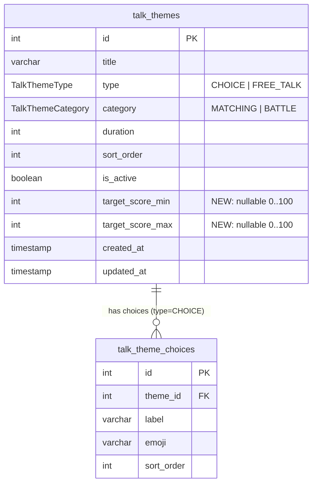
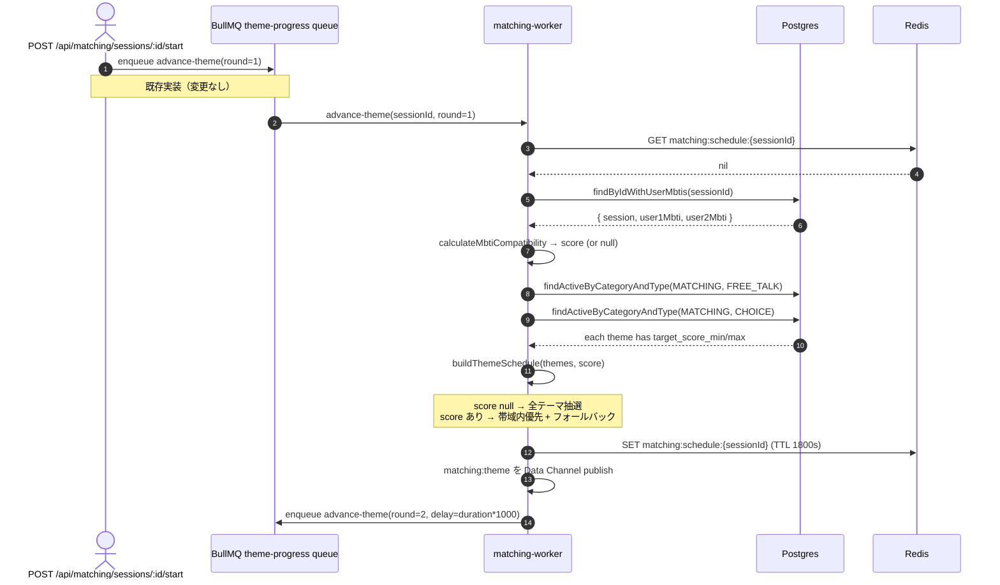

# マッチングのトークテーマを MBTI 相性に応じて最適化

## 目次

- [背景・目的](#背景目的)
- [機能一覧](#機能一覧)
- [DB 設計](#db-設計)
  - [ER 図](#er-図)
  - [`talk_themes` への追加カラム](#talk_themes-への追加カラム)
  - [スコア帯の運用方針](#スコア帯の運用方針)
- [API / ジョブ設計](#api--ジョブ設計)
- [必要な画面](#必要な画面)
- [フロー図](#フロー図)
- [注意事項](#注意事項)
- [既知の未対応](#既知の未対応)

---

## 背景・目的

Phase 6 までで、`POST /api/auth/me` 等から取得できる `users.mbti` をマッチング成立画面（`MatchedState`）で「相性スコア」として表示する経路は完成している（`apps/api/src/lib/mbti.ts` の `calculateMbtiCompatibility`）。

一方、マッチング中に流すトークテーマ（`talk_themes`）は `apps/matching-worker/src/jobs/build-theme-schedule.ts` で **完全にランダム** に 10 ラウンド分シャッフルされており、MBTI 情報を一切参照していない。

本機能では、ペアの MBTI 相性スコア（0..100）に応じてトークテーマを **「相性帯に合うもの優先」で選ぶ** ように `buildThemeSchedule` を拡張する。これにより:

- 相性が **低めのペア** には軽めの自己紹介テーマを優先 → 緊張をほぐして会話を続けやすくする
- 相性が **高めのペア** には踏み込んだ価値観テーマを優先 → 限られた 10 分間で深い会話に到達させる
- いずれかの MBTI が未設定なペアは **現状の挙動を維持**（ランダム）

API の外部仕様には影響しない。worker 内部のテーマ選択ロジックと、`talk_themes` テーブルへのカラム 2 つの追加だけで実現する。

`docs/spec/todo.md` の **Phase 6 最終タスク「Server: トークテーマを MBTI 相性に応じて最適化」** に対応する。

---

## 機能一覧

| 機能 | 詳細 |
|---|---|
| テーマのスコア帯定義 | `talk_themes` に `target_score_min` / `target_score_max`（共に nullable, 0..100）を追加。両方 null = 全帯域共通 |
| ペアの相性スコア算出 | 既存の `calculateMbtiCompatibility(user1.mbti, user2.mbti)` を worker からも呼ぶ |
| スコア帯フィルタ + フォールバック | 該当帯域 × 該当 type のテーマプールから優先抽選。プールが空ならその type の全帯域プールにフォールバック |
| MBTI 未設定ペアの互換性 | スコアが null のペアでは全帯域プールを使う（既存挙動と同等） |
| Admin 編集互換 | スコア帯カラムは Admin 経由で後から編集可能（既存の `TalkTheme` テーブル UI を拡張する想定。本フェーズでは画面変更なし、シードのみ更新） |

---

## DB 設計

### ER 図

### `talk_themes` への追加カラム

| カラム | 型 | 制約 | 説明 |
|---|---|---|---|
| `target_score_min` | `Int?` | `@default(null)`, CHECK `0..100` | 推奨スコア下限（包含）。`null` = 下限なし |
| `target_score_max` | `Int?` | `@default(null)`, CHECK `0..100` | 推奨スコア上限（包含）。`null` = 上限なし |

セマンティクス:

- ペアのスコア `s` が `(target_score_min ?? 0) <= s <= (target_score_max ?? 100)` を満たすテーマがマッチ対象
- 両方 null = 「全帯域 OK」のフラットなテーマ（既存テーマの大部分はこちら）
- スコアが null（MBTI 未設定）のペアは **全テーマを抽選対象** にする（フィルタしない）

`CHECK` 制約は migration の `ALTER TABLE` で手書き追加する（Prisma の宣言的サポート外のため）。

### スコア帯の運用方針

`apps/api/src/lib/mbti.ts` の重み設計上、現実的なスコアレンジは **57..100**（理論上は 57 が最低）。本機能では以下 3 バンドを意識して seed を整える:

| バンド | レンジ | テーマ例（既存 + 追加） |
|---|---|---|
| **LOW** | 57..69 | 食べ物の好み / 朝型夜型 / 自己紹介系 |
| **MID** | 70..84 | 趣味・休日・最近ハマっていること |
| **HIGH** | 85..100 | 価値観・将来の夢・心に残った言葉 |

- バンドの境界はあくまでシード値設計の目安。テーブル上は `target_score_min/max` の生値で管理する
- 既存テーマは原則として **両方 null（= 全帯域 OK）** のままにし、Phase 6 でのスコア帯利用は新規シード（HIGH 帯 + LOW 帯のラベル付きテーマ数本）で実現する。既存テーマのスコア帯化は運用しながら後追いで判断
- 1 セッションは 10 ラウンドで `FREE_TALK` と `CHOICE` を交互に消化するため、各 type 内で「該当帯のテーマが 1 件もない」事態を避けるよう、HIGH / LOW 帯テーマは **各 type で最低 1 件ずつ** seed する

---

## API / ジョブ設計

外部 API には変更なし。内部のジョブ I/O とリポジトリの最小拡張のみ。

| 種別 | 対象 | 変更内容 |
|---|---|---|
| Repository | `apps/matching-worker` `TalkThemeRepository.findActiveByCategoryAndType` | 戻り値の `TalkTheme` ドメイン型に `targetScoreMin: number \| null` / `targetScoreMax: number \| null` を含める |
| Repository | `apps/matching-worker` `MatchingSessionRepository` | 新メソッド `findByIdWithUserMbtis(id): { session, user1Mbti, user2Mbti }` を追加（既存 `findById` は据え置き） |
| Job | `apps/matching-worker/src/jobs/build-theme-schedule.ts` | 引数に `mbtiCompatibility: number \| null` を追加。スコア帯でテーマプールを絞ってから既存の `shuffle` を適用、空ならフォールバック |
| Job | `apps/matching-worker/src/jobs/advance-theme.ts` | schedule 生成時に `findByIdWithUserMbtis` で両者の MBTI を取得し `calculateMbtiCompatibility` で score を算出して `buildThemeSchedule` に渡す |
| Lib | worker 側に `calculateMbtiCompatibility` を移植 or 共有 | apps/api 側と二重実装を避けるため、`packages/mbti` のような共有モジュールに切り出すのが理想。本フェーズでは worker 側にコピー実装で進め、`packages/` への切り出しは後追いリファクタとする |
| Seed | `apps/api/src/prisma/seed.ts` | `TalkThemeSeed` に `targetScoreMin/targetScoreMax` を追加。既存テーマは両方 null のまま、HIGH/LOW 帯のテーマを各 type で 1〜2 件追加 |

API（HTTP）の追加・変更はなし。`GET /api/matching/sessions/:id` の `mbti_compatibility` は既存通り。

---

## 必要な画面

本フェーズでは **画面の変更なし**。

- マッチング成立画面のスコア表示は既存実装（`MatchedState`）で完了済み
- セッション中のテーマ表示も既存 UI のままで、内部選択が変わるだけ
- Admin 側でテーマのスコア帯を編集できる UI は将来の改善項目（運用上必要になった時点で追加）

---

## フロー図

---

## 注意事項

- **冪等性**: schedule は Redis に JSON で永続化されているため、worker が再起動しても同じスケジュールを再利用する。MBTI が後から変わっても、既に開始済みセッションのスケジュールには影響しない（次セッションから反映される）
- **MBTI 値の信頼性**: `users.mbti` は `VarChar(4)` の自由入力ではなく、Web 側で 16 タイプから選択するセレクタ。`calculateMbtiCompatibility` は不正値で `null` を返すので、worker は防御的に null フォールバック経路に流れる
- **テーマ枯渇**: スコア帯フィルタで該当する type のテーマプールが空になった場合、フォールバックで全帯域プールに切り替える。「特定の type が全テーマ非アクティブ」のケースは既存ロジック同様 `Error` を投げる
- **パフォーマンス**: worker は session 開始時に 1 度だけ schedule を生成するため、ペアあたりの追加クエリは「users 2 件取得」のみ。BullMQ ジョブの concurrency=50 でも DB 影響は無視できる
- **既存セッションへの後方互換**: migration 後すぐにジョブ消化に入っても、`target_score_min/max` が両方 null の既存テーマは抽選対象に含まれ続けるため、ランダム動作と同等の挙動を維持できる

---

## 既知の未対応

- `packages/mbti` 共有パッケージへの切り出し（apps/api と apps/matching-worker の重複コード）
- Admin での `target_score_min/max` 編集 UI
- スコア帯の自動チューニング（実セッションのリアクション率を学習して帯域を最適化する）
- BATTLE カテゴリへの応用（本機能は MATCHING のみ）
