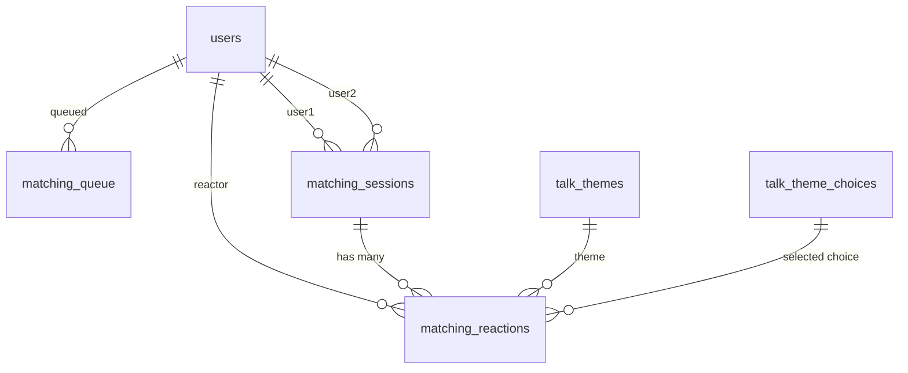
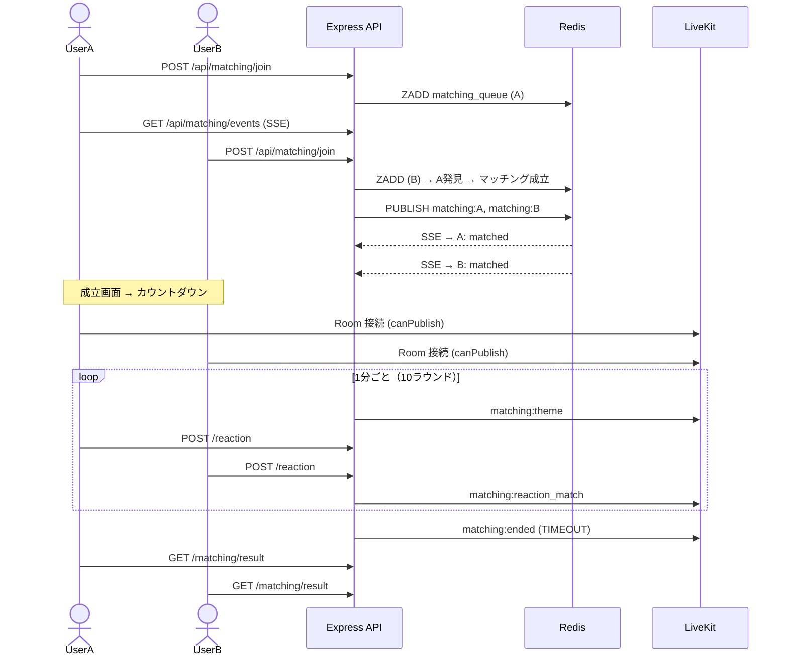

# マッチング機能（1対1）設計書

## 目次

- [概要](#概要)
- [機能一覧](#機能一覧)
- [DB 設計](#db-設計)
  - [ER 図](#er-図)
  - [matching_queue](#matching_queue)
  - [matching_sessions](#matching_sessions)
  - [matching_reactions](#matching_reactions)
- [API 設計](#api-設計)
  - [REST API](#rest-api)
  - [SSE（Server-Sent Events）](#sseserver-sent-events)
  - [LiveKit Data Channel イベント](#livekit-data-channel-イベント)
- [UI 設計](#ui-設計)
  - [画面一覧](#画面一覧)
  - [マッチング待機（/matching - 状態1）](#マッチング待機matching---状態1)
  - [マッチング成立（/matching - 状態2）](#マッチング成立matching---状態2)
  - [ビデオ通話中（/matching - 状態3）](#ビデオ通話中matching---状態3)
  - [マッチング結果（/matching/result）](#マッチング結果matchingresult)
- [仕様詳細](#仕様詳細)
  - [マッチングキュー](#マッチングキュー)
  - [マッチング成立](#マッチング成立)
  - [ビデオ通話](#ビデオ通話)
  - [時間制限とタイマー](#時間制限とタイマー)
  - [トークテーマ表示](#トークテーマ表示)
  - [リアクション（選択肢回答）](#リアクション選択肢回答)
  - [リアクション一致エフェクト](#リアクション一致エフェクト)
  - [マッチング終了](#マッチング終了)
- [サーバーサイドタイマー管理](#サーバーサイドタイマー管理)
- [フロー図](#フロー図)
- [注意事項](#注意事項)

---

## 概要

1対1のビデオ通話マッチング機能。ランダムにマッチングされた2人が10分間ビデオ通話する。1分ごとにトークテーマが表示され、選択肢に回答。同じ回答を選ぶと紙吹雪エフェクトで盛り上がる。

**参加者構成**:
- ユーザー1: 1名（Publish + Subscribe + DataPublish）
- ユーザー2: 1名（Publish + Subscribe + DataPublish）

**LiveKit Room**: `matching:{sessionId}`

---

## 機能一覧

| 機能 | 詳細 |
|------|------|
| マッチング待機 | キューに参加し、相手が見つかるまで待機。パルスアニメーション表示 |
| マッチング成立 | 2人が揃ったら SSE で通知。成立画面表示 |
| カウントダウン | 通話開始前に 3, 2, 1, START! 表示 |
| ビデオ通話 | 1対1リアルタイムビデオ通話（カメラ + マイク） |
| 時間制限 | 10分で自動終了。5分経過後に「終了」ボタン有効化 |
| トークテーマ | 1分ごとにマスターデータからテーマ表示。選択肢ボタンで回答 |
| リアクション一致 | 同じ回答を選んだ場合、紙吹雪エフェクト表示 |
| 残り時間表示 | プログレスバーで常時表示 |
| 結果画面 | 一致数一覧、フォローボタン |

---

## DB 設計

### ER 図



### matching_queue

マッチング待機キュー。Redis と併用（Redis がプライマリ、DB はバックアップ）。

| カラム | 型 | 制約 | 説明 |
|--------|------|------|------|
| id | int | PK, auto_increment | キューID |
| user_id | int | FK → users, unique, NOT NULL | 待機中ユーザー（同時1件のみ） |
| status | MatchingQueueStatus | NOT NULL, default: WAITING | WAITING / MATCHED / CANCELLED |
| created_at | timestamp | NOT NULL | キュー登録日時 |
| updated_at | timestamp | NOT NULL | 状態更新日時 |

インデックス: `user_id`(unique), `(status, created_at)`

### matching_sessions

1対1ビデオ通話のセッション記録。

| カラム | 型 | 制約 | 説明 |
|--------|------|------|------|
| id | int | PK, auto_increment | セッションID |
| user1_id | int | FK → users, NOT NULL | ユーザー1 |
| user2_id | int | FK → users, NOT NULL | ユーザー2 |
| livekit_room_name | varchar(255) | unique, NOT NULL | LiveKit ルーム名 |
| status | MatchingSessionStatus | NOT NULL, default: COUNTDOWN | COUNTDOWN / ACTIVE / ENDED |
| started_at | timestamp | nullable | 通話開始日時（カウントダウン後） |
| ended_at | timestamp | nullable | 通話終了日時 |
| end_reason | MatchingEndReason | nullable | TIMEOUT / USER_LEFT / MANUAL |
| created_at | timestamp | NOT NULL | 作成日時 |

インデックス: `livekit_room_name`(unique), `(user1_id, status)`, `(user2_id, status)`

### matching_reactions

トークテーマへの回答記録。

| カラム | 型 | 制約 | 説明 |
|--------|------|------|------|
| id | int | PK, auto_increment | リアクションID |
| session_id | int | FK → matching_sessions, NOT NULL | セッションID |
| user_id | int | FK → users, NOT NULL | 回答者 |
| theme_id | int | FK → talk_themes, NOT NULL | トークテーマID |
| choice_id | int | FK → talk_theme_choices, NOT NULL | 選択した選択肢ID |
| round_number | int | NOT NULL | ラウンド番号（1〜10） |
| created_at | timestamp | NOT NULL | 回答日時 |

制約: `@@unique([session_id, user_id, round_number])`（1ラウンドにつき1ユーザー1回答）

### Enum 定義

```typescript
enum MatchingQueueStatus { WAITING, MATCHED, CANCELLED }
enum MatchingSessionStatus { COUNTDOWN, ACTIVE, ENDED }
enum MatchingEndReason { TIMEOUT, USER_LEFT, MANUAL }
```

---

## API 設計

### REST API

| メソッド | パス | 認証 | 説明 |
|---------|------|------|------|
| POST | `/api/matching/join` | Access Token | マッチングキューに参加する。Redis Sorted Set に登録し、待機中ユーザーがいればマッチング成立。成立時はセッション情報と対戦相手を返却 |
| DELETE | `/api/matching/leave` | Access Token | マッチングキューから離脱する。Redis と DB の両方から削除 |
| GET | `/api/matching/status` | Access Token | 待機状態（ステータス、キュー位置、待機開始時刻）を確認する |
| POST | `/api/matching/token` | Access Token | LiveKit Room 接続トークンを生成する。両ユーザーに canPublish + canSubscribe + canPublishData |
| GET | `/api/matching/sessions/:id` | Access Token | セッション情報（両ユーザー、ステータス、残り時間、ラウンド、終了可否）を取得する |
| POST | `/api/matching/sessions/:id/end` | Access Token | セッションを手動終了する。5分経過後のみ可能（5分未満は 400） |
| POST | `/api/matching/sessions/:id/reaction` | Access Token | トークテーマへの回答を送信する。相手が回答済みなら一致判定結果も返却 |
| GET | `/api/matching/sessions/:id/reactions` | Access Token | 全リアクション履歴（各ラウンドのテーマ、両者回答、一致/不一致）を取得する |

### SSE（Server-Sent Events）

| メソッド | パス | 認証 | 説明 |
|---------|------|------|------|
| GET | `/api/matching/events` | Access Token | マッチング待機中にリアルタイム通知する。`matched`（成立通知）、`heartbeat`（30秒間隔）、`cancelled`（サーバー側キャンセル） |

### LiveKit Data Channel イベント

| イベント名 | 方向 | モード | 説明 |
|-----------|------|--------|------|
| `matching:theme` | Server → Room | Reliable | 1分ごとに新しいトークテーマ（タイトル + 選択肢 + ラウンド番号）を配信 |
| `matching:reaction` | User → Room | Reliable | 選択肢の回答を送信 |
| `matching:reaction_match` | Server → Room | Reliable | 両者の回答照合結果（一致/不一致）を通知 |
| `matching:timer` | Server → Room | Lossy | 30秒間隔で残り時間と終了可能フラグを送信 |
| `matching:ended` | Server → Room | Reliable | セッション終了を通知（理由: TIMEOUT / USER_LEFT / MANUAL） |

---

## UI 設計

### 画面一覧

| パス | 画面名 | 認証 |
|------|--------|------|
| `/matching` | マッチング（状態遷移あり） | 必要 |
| `/matching/result` | マッチング結果 | 必要 |

### マッチング待機（/matching - 状態1）

```
┌─────────────────────────────────────────┐
│                                         │
│       [パルスするパープル円アニメ]       │
│            マッチング中...               │
│                                         │
│           待機時間: 00:45                │
│                                         │
│           [キャンセル]                   │
│                                         │
└─────────────────────────────────────────┘
```

### マッチング成立（/matching - 状態2）

```
┌─────────────────────────────────────────┐
│                                         │
│         マッチング成立!                  │
│                                         │
│    [Avatar A]  ⚡  [Avatar B]           │
│     UserA          UserB                │
│                                         │
└─────────────────────────────────────────┘
```

2秒後にカウントダウンに遷移。

### ビデオ通話中（/matching - 状態3）

```
┌─────────────────────────────────────────┐
│ [===== 残り 7:23 ==================---] │
│                                         │
│ ┌─────────────────┐ ┌─────────────────┐ │
│ │   相手の映像     │ │   自分の映像     │ │
│ └─────────────────┘ └─────────────────┘ │
│                                         │
│ ┌─────────────────────────────────────┐ │
│ │ 🍣 好きな食べ物のジャンルは？        │ │
│ │ [🍣 和食] [🍝 洋食] [🍜 中華] [🍛] │ │
│ └─────────────────────────────────────┘ │
│                                         │
│ [🎤 ミュート] [📷 カメラ] [終了(5分後)] │
└─────────────────────────────────────────┘
```

- **タイマーバー**: 上部。パープル → 残り2分でアンバー → 残り30秒で赤+点滅
- **トークテーマカード**: 1分ごとに切替。選択肢は横並びボタン
- **リアクション一致時**: 紙吹雪 + 「一致!」ポップアップ
- **終了ボタン**: 5分まではグレーアウト

### マッチング結果（/matching/result）

```
┌─────────────────────────────────────────┐
│       マッチング終了!                    │
│    [Avatar A]  ♥  [Avatar B]            │
│    一致した回答: 7/10                    │
│    ┌──────────────────────────────┐     │
│    │ R1: 好きな食べ物 → 🍣 一致! │     │
│    │ R2: 休日の過ごし方 → ✕      │     │
│    └──────────────────────────────┘     │
│    [フォローする]  [ホームに戻る]        │
└─────────────────────────────────────────┘
```

---

## 仕様詳細

### マッチングキュー

**Redis データ構造**:
```
matching_queue (Sorted Set): score=timestamp, member=userId
matching:{userId} (Pub/Sub channel): マッチング成立通知
```

**マッチングロジック**:
1. `ZADD matching_queue {timestamp} {userId}`
2. `ZRANGE matching_queue 0 0` で最古の待機ユーザーを取得
3. 自分以外がいればマッチング成立 → `WATCH` + `MULTI/EXEC` で排他制御
4. 両ユーザーをキューから削除 + セッション作成
5. Redis Pub/Sub で両ユーザーに SSE 通知

**ブロック済みユーザー同士はマッチングしない**（キュー走査時にブロック関係をチェック）。

### マッチング成立

SSE で `matched` イベント受信 → 成立画面（2秒）→ カウントダウン → ビデオ通話

### ビデオ通話

- LiveKit Room `matching:{sessionId}` に両ユーザー接続
- 両者 canPublish + canSubscribe + canPublishData
- UI: 左右にビデオ（lg）、上下（sm）

### 時間制限とタイマー

| 時間 | イベント |
|------|---------|
| 0:00 | 通話開始 |
| 0:00〜5:00 | 「終了」ボタン無効（グレーアウト） |
| 5:00 | 「終了」ボタン有効化 |
| 8:00 | タイマーバーがアンバーに変化 |
| 9:30 | タイマーバーが赤 + 点滅 |
| 10:00 | 自動終了 |

### トークテーマ表示

1分ごとにサーバーからランダムテーマ（MATCHING カテゴリ）を Data Channel で配信。合計10ラウンド。

### リアクション（選択肢回答）

1. テーマ表示 → 選択肢タップ → `POST /api/matching/sessions/:id/reaction` + Data Channel 送信
2. 相手の回答は自分が回答するまで「?」マスク → 両者回答後に同時公開
3. サーバーが一致判定 → `matching:reaction_match` で通知

### リアクション一致エフェクト

- 一致: 「一致!」ポップアップ + 紙吹雪（パープル + ホットピンク + ゴールド）
- 不一致: 両者の回答表示のみ（エフェクトなし）

### マッチング終了

**終了トリガー**: 10分タイムアウト / 5分後の手動終了 / 相手離脱

---

## サーバーサイドタイマー管理

```
セッション開始時:
  1. Redis: matching:timer:{sessionId} = startedAt (EXPIRE 600)
  2. setInterval (30秒ごと): matching:timer イベント送信
  3. setInterval (60秒ごと): matching:theme イベント送信
  4. 10分経過: 自動終了処理
```

Redis に状態保持 → サーバー再起動時に復元可能。

---

## フロー図



---

## 注意事項

### セキュリティ
- 認証済みユーザーのみキュー参加可能
- 5分未満の終了はサーバーサイドで拒否
- ブロック済みユーザー同士はマッチングしない

### パフォーマンス
- キューは Redis で管理（DB アクセス最小限）
- タイマーイベントは30秒間隔（クライアントでローカル補間）

### エッジケース
- 片方離脱: `participant_left` → 相手に通知 + 終了
- 同時離脱: `room_finished` → 終了
- サーバー再起動: Redis から復元
- テーマ10個未満: 重複選択（シャッフル順変更）
