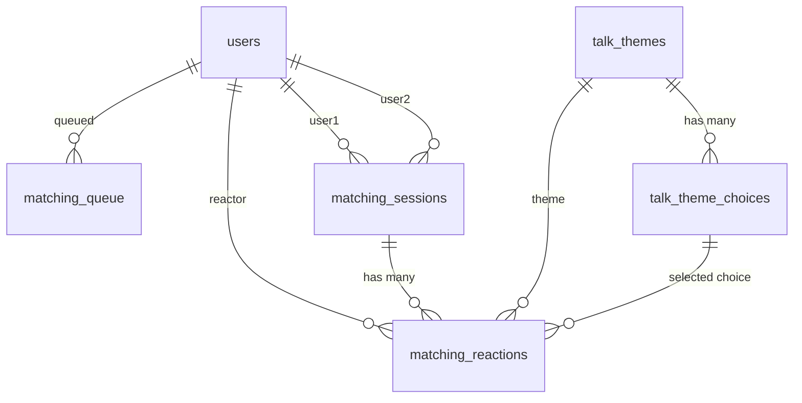
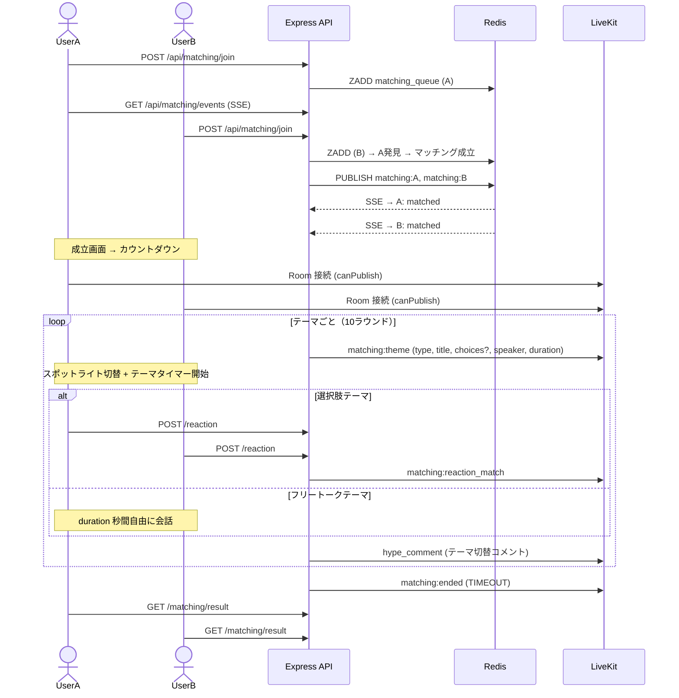

# マッチング機能（1対1）設計書

## 目次

- [概要](#概要)
- [機能一覧](#機能一覧)
- [DB 設計](#db-設計)
  - [ER 図](#er-図)
  - [talk_themes](#talk_themes)
  - [talk_theme_choices](#talk_theme_choices)
  - [matching_queue](#matching_queue)
  - [matching_sessions](#matching_sessions)
  - [matching_reactions](#matching_reactions)
- [API 設計](#api-設計)
  - [REST API](#rest-api)
  - [SSE（Server-Sent Events）](#sseserver-sent-events)
  - [LiveKit Data Channel イベント](#livekit-data-channel-イベント)
- [UI 設計](#ui-設計)
  - [画面一覧](#画面一覧)
  - [マッチング待機（/matching - 状態1）](#マッチング待機matching---状態1)
  - [マッチング成立（/matching - 状態2）](#マッチング成立matching---状態2)
  - [ビデオ通話中（/matching - 状態3）](#ビデオ通話中matching---状態3)
  - [マッチング結果（/matching/result）](#マッチング結果matchingresult)
- [仕様詳細](#仕様詳細)
  - [マッチングキュー](#マッチングキュー)
  - [マッチング成立](#マッチング成立)
  - [ビデオ通話](#ビデオ通話)
  - [時間制限とタイマー](#時間制限とタイマー)
  - [トークテーマ表示](#トークテーマ表示)
  - [テーマ種別](#テーマ種別)
  - [スポットライト演出](#スポットライト演出)
  - [テーマごとタイマー](#テーマごとタイマー)
  - [盛り上げコメント](#盛り上げコメント)
  - [リアクション（選択肢回答）](#リアクション選択肢回答)
  - [リアクション一致エフェクト](#リアクション一致エフェクト)
  - [スタンプ送信](#スタンプ送信)
  - [マッチング終了](#マッチング終了)
- [サーバーサイドタイマー管理](#サーバーサイドタイマー管理)
- [フロー図](#フロー図)
- [マッチングフィルタリング（将来フェーズ）](#マッチングフィルタリング将来フェーズ)
- [マッチング後のリレーション形成（将来フェーズ）](#マッチング後のリレーション形成将来フェーズ)
- [注意事項](#注意事項)
- [実装ステップ](#実装ステップ)

---

## 概要

1対1のビデオ通話マッチング機能。ランダムにマッチングされた2人が10分間ビデオ通話する。1分ごとにトークテーマが表示され、選択肢に回答。同じ回答を選ぶと紙吹雪エフェクトで盛り上がる。

**参加者構成**:
- ユーザー1: 1名（Publish + Subscribe + DataPublish）
- ユーザー2: 1名（Publish + Subscribe + DataPublish）

**LiveKit Room**: `matching:{sessionId}`

---

## 機能一覧

| 機能 | 詳細 |
|------|------|
| マッチング待機 | キューに参加し、相手が見つかるまで待機。パルスアニメーション表示 |
| マッチング成立 | 2人が揃ったら SSE で通知。成立画面表示 |
| カウントダウン | 通話開始前に 3, 2, 1, START! 表示 |
| ビデオ通話 | 1対1リアルタイムビデオ通話（カメラ + マイク）。全画面ビデオ + オーバーレイ UI |
| 時間制限 | 10分で自動終了。5分経過後に「終了」ボタン有効化 |
| トークテーマ | テーマごとに制限時間あり。選択肢テーマとフリートークテーマの2種類 |
| スポットライト | テーマごとに話す人を交互に指定。対象のビデオにグロー演出 + 「🎤 話す番」バッジ |
| テーマごとタイマー | テーマごとに15〜30秒の制限時間。時間切れで自動的に次のテーマへ遷移 |
| 盛り上げコメント | テーマ切替時に「本当に相手の心つかめたか？」等のコメントを画面中央に表示 |
| リアクション一致 | 同じ回答を選んだ場合、紙吹雪エフェクト表示 |
| リアクションバブル | 選択肢を選ぶと相手のビデオ画面上にバブルがフロートするアニメーション |
| スタンプ送信 | 通話中に相手画面へスタンプを送信。`scope=MATCHING` のスタンプを `<StampPalette>` から選択し、相手のビデオ上に `<StampFloatLayer>` でフロート表示 |
| 残り時間表示 | テーマごとのプログレスバーで常時表示 |
| アクセス制御 | マッチング成立した2人のみが通話画面に参加可能。セッション ID + ユーザー認証で検証 |
| 結果画面 | 一致数一覧、フォローボタン |

---

## DB 設計

### ER 図



### talk_themes

トークテーマのマスターデータ。選択肢テーマ（choice）とフリートークテーマ（free_talk）の2種類。

| カラム | 型 | 制約 | 説明 |
|--------|------|------|------|
| id | int | PK, auto_increment | テーマID |
| title | varchar(255) | NOT NULL | テーマタイトル（例: 「好きな食べ物のジャンルは？」） |
| type | TalkThemeType | NOT NULL | CHOICE / FREE_TALK |
| category | varchar(50) | NOT NULL, default: MATCHING | テーマカテゴリ（MATCHING / BATTLE 等） |
| duration | int | NOT NULL, default: 20 | テーマの制限時間（秒） |
| sort_order | int | NOT NULL, default: 0 | 表示順 |
| created_at | timestamp | NOT NULL | 作成日時 |
| updated_at | timestamp | NOT NULL | 更新日時 |

### talk_theme_choices

選択肢テーマ（type=CHOICE）の選択肢マスターデータ。

| カラム | 型 | 制約 | 説明 |
|--------|------|------|------|
| id | int | PK, auto_increment | 選択肢ID |
| theme_id | int | FK → talk_themes, NOT NULL | 所属テーマ |
| label | varchar(100) | NOT NULL | 選択肢ラベル（例: 「🍣 和食」） |
| sort_order | int | NOT NULL, default: 0 | 表示順 |
| created_at | timestamp | NOT NULL | 作成日時 |

インデックス: `(theme_id, sort_order)`

### matching_queue

マッチング待機キュー。Redis と併用（Redis がプライマリ、DB はバックアップ）。

| カラム | 型 | 制約 | 説明 |
|--------|------|------|------|
| id | int | PK, auto_increment | キューID |
| user_id | int | FK → users, unique, NOT NULL | 待機中ユーザー（同時1件のみ） |
| status | MatchingQueueStatus | NOT NULL, default: WAITING | WAITING / MATCHED / CANCELLED |
| created_at | timestamp | NOT NULL | キュー登録日時 |
| updated_at | timestamp | NOT NULL | 状態更新日時 |

インデックス: `user_id`(unique), `(status, created_at)`

### matching_sessions

1対1ビデオ通話のセッション記録。

| カラム | 型 | 制約 | 説明 |
|--------|------|------|------|
| id | int | PK, auto_increment | セッションID |
| user1_id | int | FK → users, NOT NULL | ユーザー1 |
| user2_id | int | FK → users, NOT NULL | ユーザー2 |
| livekit_room_name | varchar(255) | unique, NOT NULL | LiveKit ルーム名 |
| status | MatchingSessionStatus | NOT NULL, default: COUNTDOWN | COUNTDOWN / ACTIVE / ENDED |
| started_at | timestamp | nullable | 通話開始日時（カウントダウン後） |
| ended_at | timestamp | nullable | 通話終了日時 |
| end_reason | MatchingEndReason | nullable | TIMEOUT / USER_LEFT / MANUAL |
| created_at | timestamp | NOT NULL | 作成日時 |

インデックス: `livekit_room_name`(unique), `(user1_id, status)`, `(user2_id, status)`

### matching_reactions

トークテーマへの回答記録。選択肢テーマ（type=CHOICE）の場合のみ `choice_id` が設定される。

| カラム | 型 | 制約 | 説明 |
|--------|------|------|------|
| id | int | PK, auto_increment | リアクションID |
| session_id | int | FK → matching_sessions, NOT NULL | セッションID |
| user_id | int | FK → users, NOT NULL | 回答者 |
| theme_id | int | FK → talk_themes, NOT NULL | トークテーマID |
| choice_id | int | FK → talk_theme_choices, nullable | 選択した選択肢ID（CHOICE テーマのみ） |
| round_number | int | NOT NULL | ラウンド番号（1〜10） |
| created_at | timestamp | NOT NULL | 回答日時 |

制約: `@@unique([session_id, user_id, round_number])`（1ラウンドにつき1ユーザー1回答）

### Enum 定義

```typescript
enum MatchingQueueStatus { WAITING, MATCHED, CANCELLED }
enum MatchingSessionStatus { COUNTDOWN, ACTIVE, ENDED }
enum MatchingEndReason { TIMEOUT, USER_LEFT, MANUAL }
enum TalkThemeType { CHOICE, FREE_TALK }
```

---

## API 設計

### REST API

| メソッド | パス | 認証 | 説明 |
|---------|------|------|------|
| POST | `/api/matching/join` | Access Token | マッチングキューに参加する。Redis Sorted Set に登録し、待機中ユーザーがいればマッチング成立。成立時はセッション情報と対戦相手を返却 |
| DELETE | `/api/matching/leave` | Access Token | マッチングキューから離脱する。Redis と DB の両方から削除 |
| GET | `/api/matching/status` | Access Token | 待機状態（ステータス、キュー位置、待機開始時刻）を確認する |
| POST | `/api/matching/token` | Access Token | LiveKit Room 接続トークンを生成する。両ユーザーに canPublish + canSubscribe + canPublishData |
| GET | `/api/matching/sessions/:id` | Access Token | セッション情報（両ユーザー、ステータス、残り時間、ラウンド、終了可否）を取得する |
| POST | `/api/matching/sessions/:id/end` | Access Token | セッションを手動終了する。5分経過後のみ可能（5分未満は 400） |
| POST | `/api/matching/sessions/:id/reaction` | Access Token | トークテーマへの回答を送信する。相手が回答済みなら一致判定結果も返却 |
| GET | `/api/matching/sessions/:id/reactions` | Access Token | 全リアクション履歴（各ラウンドのテーマ、両者回答、一致/不一致）を取得する |
| POST | `/api/matching/sessions/:id/stamp` | Access Token | スタンプを送信する。リクエストに `item_id`（`items.type=STAMP` かつ `scope` に `MATCHING` を含む）を渡す。プレミアムスタンプは `user_inventory` 所持確認後にサーバー側から Data Channel `matching:stamp` を配信 |

### SSE（Server-Sent Events）

| メソッド | パス | 認証 | 説明 |
|---------|------|------|------|
| GET | `/api/matching/events` | Access Token | マッチング待機中にリアルタイム通知する。`matched`（成立通知）、`heartbeat`（30秒間隔）、`cancelled`（サーバー側キャンセル） |

### LiveKit Data Channel イベント

| イベント名 | 方向 | モード | 説明 |
|-----------|------|--------|------|
| `matching:theme` | Server → Room | Reliable | テーマごとの制限時間経過後に次テーマ配信（type, title, choices?, speaker, duration, round） |
| `matching:hype` | Server → Room | Reliable | テーマ切替時の盛り上げコメントを配信 |
| `matching:reaction` | User → Room | Reliable | 選択肢の回答を送信 |
| `matching:reaction_match` | Server → Room | Reliable | 両者の回答照合結果（一致/不一致）を通知 |
| `matching:stamp` | Server → Room | Reliable | スタンプ送信を相手へ通知（送信者 ID、`item_id`、`emoji`、`animation_type` を含む。受信側は `<StampFloatLayer>` でフロート表示） |
| `matching:timer` | Server → Room | Lossy | 30秒間隔で残り時間と終了可能フラグを送信 |
| `matching:ended` | Server → Room | Reliable | セッション終了を通知（理由: TIMEOUT / USER_LEFT / MANUAL） |

---

## UI 設計

### 画面一覧

| パス | 画面名 | 認証 | レイアウトモード |
|------|--------|------|----------------|
| `/matching` | マッチングロビー（待機ユーザー一覧 + 開始ボタン） | 必要 | default（ナビバー + サイドバー） |
| `/matching/session` | マッチングセッション（状態遷移あり） | 必要 | immersive（フルスクリーン） |
| `/matching/result` | マッチング結果 | 必要 | default |

### マッチングロビー（/matching）

マッチング待機中の他ユーザー一覧と「マッチング開始」CTA を表示する集合場所的なページ。AppShell 上では default モードでナビバー + サイドバーが表示される。

```
┌──────────────────────────────────────────────────────────────┐
│                       🤝 マッチング                          │
│         ランダムにマッチングされた相手と10分間の              │
│              ビデオ通話を楽しもう                             │
│                                                              │
│            ┌──────────────────────────────┐                  │
│            │     マッチング開始（CTA）     │                  │
│            └──────────────────────────────┘                  │
│            [🔍 フィルター設定 (Coming Soon)]                  │
│                                                              │
│  マッチング待機中  [8人] ●（パルス）                          │
│                                                              │
│  ┌────┐ ┌────┐ ┌────┐ ┌────┐                                │
│  │🎸  │ │🎮  │ │💃  │ │🍳  │                                │
│  │名前│ │名前│ │名前│ │名前│                                │
│  │24歳│ │22歳│ │28歳│ │25歳│                                │
│  │●待機│ │●待機│ │●待機│ │●待機│                              │
│  └────┘ └────┘ └────┘ └────┘                                │
└──────────────────────────────────────────────────────────────┘
```

#### レイアウト

- **コンテナ**: `relative min-h-screen p-6`、内側に `mx-auto max-w-4xl`
- **背景装飾**: `pointer-events-none fixed inset-0 overflow-hidden`。500px のパープル blur オーブ（左上 1/4 位置、`bg-primary/[0.04] blur-[150px]`）と 400px のシアン blur オーブ（右下 1/4 位置、`bg-cyan/[0.04] blur-[150px]`）を配置
- **ヘッダー**: 中央寄せ、初回 `y: -20` から fade-in。「🤝 マッチング」（`text-3xl font-bold`）+ サブテキスト「ランダムにマッチングされた相手と10分間のビデオ通話を楽しもう」
- **マッチング開始 CTA**:
  - 縦並び `flex flex-col items-center gap-4`、初回 spring で `scale: 0.9 → 1`
  - メインボタン: `<Link href="/matching/session">`、`px-16 py-5`、`rounded-2xl`、`text-lg font-bold text-white`
    - 背景: 3 点グラデ `linear-gradient(135deg, #CBACF9 0%, #0EA5E9 50%, #CBACF9 100%)`、`backgroundSize: 200% 200%`、`animation: gradient-shift 3s ease infinite`（`@keyframes` で `background-position: 0% 50% → 100% 50% → 0% 50%`）
    - ホバー: `scale-105` + `shadow: 0_0_40px_rgba(203,172,249,0.3)` + 内側に高速グラデ（2 秒ループ）
  - **フィルター設定ボタン**（Coming Soon、disabled なし表示）: `🔍 フィルター設定` + `Coming Soon` 小バッジ。`border: 1px solid rgba(255,255,255,0.08)`、`text-text-muted`
- **待機中ユーザーセクション**:
  - セクションヘッダ:「マッチング待機中」+ `bg-success/20` 緑バッジで人数 + 緑のパルスドット（`animate-ping` の二重表示）
  - グリッド: `grid grid-cols-2 gap-3 sm:grid-cols-3 md:grid-cols-4`
  - 各カード: `motion.div` で `delay: 0.4 + i * 0.05` で順次フェードイン
    - 背景: `rgba(255,255,255,0.02)` + `border: 1px solid rgba(255,255,255,0.06)`
    - ホバー: `shadow: 0_0_20px_rgba(203,172,249,0.08)`
    - 構造（縦並び中央寄せ）:
      - 56px 円形アバター（パープル+シアングラデ背景 + 1px 白枠）に絵文字（24px）
      - 名前（`text-sm font-medium`）
      - `{年齢}歳 ・ {性別}`（`text-xs text-text-muted`）
      - 下部に小さな緑ドット + 「待機中」（`text-[10px]`）

#### データ要件

- 待機ユーザー一覧: マッチングキューに参加した認証済みユーザー（自分を除く）
  - データソース: `GET /api/matching/queue`（新規エンドポイント、または `GET /api/matching/status` を全体取得用に拡張）
  - 表示項目: `id, name, avatar_url, age, gender`
- 「マッチング開始」クリックで `/matching/session` に遷移。遷移先で `POST /api/matching/join` を実行

### マッチングセッション（/matching/session）

immersive モード。1 ページ内で 4 つの状態（`waiting → matched → countdown → active`）を `AnimatePresence mode="wait"` で切替える。

```ts
type MatchingState = "waiting" | "matched" | "countdown" | "active"
```

#### 状態遷移

```
waiting (キュー登録 + SSE 待機)
   ↓ SSE で matched イベント受信
matched (成立通知 2秒)
   ↓ setTimeout 2秒
countdown (3 → 2 → 1 → START!)
   ↓ 各1秒、4ステップ
active (ビデオ通話 + テーマ進行)
```

`COUNTDOWN_SEQUENCE = ["3", "2", "1", "START!"]` を 1 秒ごとに進め、配列末尾に到達した時点で `setState("active")`。

ローカル状態（実装パターン）:
```ts
const [state, setState] = useState<MatchingState>("waiting")
const [waitTime, setWaitTime] = useState(0)
const [countdownIndex, setCountdownIndex] = useState(0)
const [currentThemeIndex, setCurrentThemeIndex] = useState(0)
const [selectedChoice, setSelectedChoice] = useState<string | null>(null)
const [reactions, setReactions] = useState<ReactionBubble[]>([])
const [themeTimeLeft, setThemeTimeLeft] = useState(初期テーマのduration)
const [hypeComment, setHypeComment] = useState<string | null>(null)
const [isTransitioning, setIsTransitioning] = useState(false)
const [freeTalkRequested, setFreeTalkRequested] = useState(false)
```

#### 状態 1: waiting（マッチング待機）

```
┌─────────────────────────────────────────┐
│                                         │
│            （三重パルス円）              │
│            ┌──────┐                     │
│            │ 🤝   │                     │
│            └──────┘                     │
│         マッチング中...                  │
│         待機時間: 00:45                  │
│                                         │
│            [キャンセル]                  │
│                                         │
└─────────────────────────────────────────┘
```

- **三重パルス円**: 中心から外側に向けて 3 重の円。最外殻 144px、中殻 112px、最内殻 80px
  - 最外殻: `radial-gradient(circle, rgba(203,172,249,0.15) 0%, rgba(14,165,233,0.08) 50%, transparent 70%)`、`scale: [1, 1.15, 1]` を 2 秒ループ
  - 中殻: `radial-gradient(circle, rgba(203,172,249,0.2) 0%, rgba(14,165,233,0.1) 70%)`
  - 最内殻: `bg-gradient-to-br from-primary to-cyan` + `shadow: 0_0_30px_rgba(203,172,249,0.3)` + `🤝` 絵文字（36px）
- **テキスト**: `text-xl font-bold` 「マッチング中...」、下に `text-sm text-text-muted`「待機時間: M:SS」（1秒ごとカウントアップ）
- **キャンセルボタン**: `border border-white/[0.08] px-8 py-2.5 rounded-xl`。クリックで `DELETE /api/matching/leave` → `/matching` に戻る
- 背景装飾: パープル orb + シアン orb

#### 状態 2: matched（マッチング成立）

```
┌─────────────────────────────────────────┐
│         マッチング成立!                  │
│                                         │
│    [Avatar A]  ⚡  [Avatar B]           │
│     あなた     UserB                    │
└─────────────────────────────────────────┘
```

- **タイトル**: `text-3xl font-bold` + グラデ `from-primary via-cyan to-primary` を `bg-clip-text text-transparent`「マッチング成立!」
- **アバター対面**: 左に自分、中央に `⚡`（spring で `rotate: -180 → 0`, `scale: 0 → 1`、`delay: 0.3`）、右に相手
  - 自分: 80px 角丸正方形、`bg-gradient-to-br from-primary/20 to-primary/5` + `glow-border-purple`
  - 相手: 同サイズ、`bg-gradient-to-br from-cyan/20 to-cyan/5` + `glow-border-cyan`
  - スライドイン: 自分 `x: -60 → 0`、相手 `x: 60 → 0`
- **2 秒経過で countdown に自動遷移**

#### 状態 3: countdown（カウントダウン）

`<CountdownOverlay>` 仕様（[common/README.md](../common/README.md) 参照）。

- 表示シーケンス: `["3", "2", "1", "START!"]` を 1 秒ごと
- `countdownIndex >= COUNTDOWN_SEQUENCE.length` で `setState("active")`
- 背景: `rgba(0,3,25,0.92)` + `backdrop-filter: blur(12px)` のフルスクリーン
- 数字: 140px パープル→シアングラデ + 60px の発光ドロップシャドウ

#### 状態 4: active（ビデオ通話中）

ビデオを左右 1:1 で全画面表示し、UI はすべてオーバーレイとして重ねる。

```
┌─────────────────────────────────────────────────────┐
│ [=== テーマタイマー ===========---]   18s          │ ← 上部タイマー
│         ┌─シャボン玉風テーマカード─┐ [💬希望]      │
│         │ 好きな食べ物のジャンル？  │              │
│         │ [🍣和食][🍝洋食][🍜中華]│              │
│         └──────────────────────────┘              │
│                                                     │
│ ┌─── 相手のビデオ ────┐┌─── 自分のビデオ ────┐  │
│ │   ✨スポットライト   ││                      │  │ ← user2 が話す番
│ │  [🎤 話す番] バッジ  ││                      │  │
│ │  [🍣和食]↑バブル    ││                      │  │
│ │  ギターマスター      ││  あなた              │  │
│ └─────────────────────┘└──────────────────────┘  │
│            [🎤ミュート][📷カメラ][終了]            │ ← 下部コントロール
└─────────────────────────────────────────────────────┘
```

##### ビデオエリア

- 全画面 `flex h-full w-full` で左右 1:1 配置
- **相手側（user2、左）**:
  - 背景: `bg-gradient-to-br from-cyan-900/20 to-blue-900/15`
  - 中央に大きな絵文字（プレースホルダー、`text-8xl opacity-10`）
  - 下部に半透明グラデ（`bg-gradient-to-t from-dark-base/30 to-transparent`）
  - 左下の名前タグ: `rounded-lg px-2.5 py-1` + `rgba(0,3,25,0.6) backdrop-blur-sm`
  - 右側に 1px 区切り（`border-right: 1px solid rgba(255,255,255,0.06)`）
- **自分側（user1、右）**:
  - 背景: `bg-gradient-to-br from-purple-900/20 to-indigo-900/15`
  - その他は user2 と対称構造、左下の名前は「あなた」

##### スポットライト

`currentTheme.speaker` で「話す番」のユーザーを示す。

- スポットライト中のビデオパネルに `box-shadow` でグロー演出（`transition: 0.6s`）
  - **user1 の番**: `inset 0 0 80px rgba(203,172,249,0.12), inset 0 0 160px rgba(203,172,249,0.04), 0 0 40px rgba(203,172,249,0.08)`
  - **user2 の番**: 同構造でシアン `rgba(14,165,233,...)` を使用
- スポットライト中のパネル右上（`right-4 top-14`）に「🎤 話す番」バッジ
  - user1: `bg: rgba(203,172,249,0.15)` + 1px パープル枠 + パープルグロー、文字 `text-primary`
  - user2: `bg: rgba(14,165,233,0.15)` + 1px シアン枠 + シアングロー、文字 `text-cyan`
  - Framer Motion で `scale: 0.8 → 1` で出入り

##### テーマカード（ヘッダー位置のシャボン玉風）

`absolute left-1/2 top-10 w-full max-w-2xl -translate-x-1/2 px-4`。

- **背景**: `radial-gradient(ellipse at 25% 15%, rgba(255,255,255,0.12) 0%, rgba(203,172,249,0.08) 30%, rgba(14,165,233,0.06) 60%, rgba(255,255,255,0.03) 100%)` + `backdrop-filter: blur(20px)` + 1px 白透過枠
- **影**: `0 8px 32px rgba(0,0,0,0.2), inset 0 1px 0 rgba(255,255,255,0.1), inset 0 0 40px rgba(203,172,249,0.04)`（光沢風）
- **タイトル**: `text-sm font-bold text-white/90`、中央寄せ
- **テーマ種別ごとの表示**:
  - **CHOICE（選択肢）**: タイトル下に選択肢ボタンを `flex flex-wrap justify-center gap-2` で並べる
    - 通常: `bg: rgba(255,255,255,0.06)` + blur + 1px 白枠、`text-white/70`
    - 選択中: `scale-105 text-white shadow-[0_0_24px_rgba(203,172,249,0.4)]` + グラデ背景 `linear-gradient(135deg, rgba(203,172,249,0.5), rgba(14,165,233,0.4))` + 1px 白枠（30%）
    - クリックでローカル即時選択 + リアクションバブル発火 + 1.5 秒後に次テーマへ進む
  - **FREE_TALK（フリートーク）**: タイトル下に小さな italic テキスト「フリートーク — 自由に話してみましょう！」（`text-xs italic text-white/40`）
- テーマ切替時は `AnimatePresence mode="wait"` で `key={currentTheme.id}` を変更してフェード/スケール

##### フリートーク希望ボタン（NEW）

テーマカード右側に並ぶサブアクション。中盤に CHOICE が連続するときなど、ユーザーが「自由に話したい」とアプリに伝えるためのトグル。

- **配置**: テーマカードと同じ高さ。`shrink-0 rounded-xl px-3 py-2.5`
- **未押下**: `bg: rgba(255,255,255,0.06) backdrop-blur-md` + 1px 白枠、`text-white/60`、ラベル「💬 フリートーク希望」
- **押下中**: `linear-gradient(135deg, rgba(236,72,153,0.4), rgba(203,172,249,0.3))` + 1px ピンク枠 + ピンクグロー、`text-white`、ラベル「💬 申請中」
- 状態は `freeTalkRequested: boolean` でローカル管理
- **将来の挙動**: 両者が「申請中」になったら直近の CHOICE をスキップして FREE_TALK に切替えるサーバー側ロジックを追加（Spec1 では UI のみ）

##### リアクションバブル

選択肢タップ時に「相手のビデオ画面」上にバブルを表示するアニメーション。自分が選択した内容を「相手のビデオに表示」する点が重要（自分の選択を相手に見せる演出）。

- 構造: `{ id: number, choice: string, x: number }` の配列を 2 秒で生成→削除
- **配置**: `absolute bottom-30% left-{x}%`（`x = 20-80` のランダム）
- **バブルスタイル**:
  - 背景: `radial-gradient(ellipse at 30% 20%, rgba(255,255,255,0.25) 0%, rgba(203,172,249,0.15) 40%, rgba(14,165,233,0.1) 100%)` + blur
  - 1px 白透過枠、`box-shadow: 0 0 20px rgba(203,172,249,0.3), inset 0 0 20px rgba(255,255,255,0.05)`
- **アニメ**: `initial={opacity: 0.9, scale: 0.5, y: 0}` → `animate={opacity: 1, scale: 1, y: -200}` → `exit={opacity: 0}`、`duration: 2 ease-out`

##### テーマごとタイマーバー

画面最上部に固定 4px のプログレスバー。

- **配置**: `absolute left-0 right-0 top-0 px-4 pt-2`
- **トラック**: `h-1 w-full overflow-hidden rounded-full bg-white/[0.08]`
- **バー本体**: `h-full rounded-full bg-gradient-to-r {gradient}`
  - `themeTimeLeft > 10`: `from-primary via-cyan to-primary`
  - `10 ≥ themeTimeLeft > 5`: `from-warning to-warning`
  - `themeTimeLeft ≤ 5`: `from-error to-error` + `animate-pulse`
- **滑らかなアニメ**: テーマ切替時に React `key={currentTheme.id}` を更新し、CSS `@keyframes timer-shrink` を `animation: timer-shrink ${currentTheme.duration}s linear forwards` で適用（`width: 100% → 0%`）。`isTransitioning` 中は `width: 0%` 固定
- 下に残り秒数を `text-xs text-white/60` で中央表示

##### 盛り上げコメントオーバーレイ

テーマ切替時の 2 秒間（`isTransitioning = true` の間）、画面中央に盛り上げメッセージを表示する。

- **配置**: `pointer-events-none fixed inset-0 z-40 flex items-center justify-center`
- **テキスト**: `text-4xl md:text-5xl font-bold` + 3 点グラデ `from-accent-pink via-primary to-cyan` を `bg-clip-text text-transparent`
- **発光**: `filter: drop-shadow(0 0 40px rgba(236,72,153,0.4))`
- **アニメ**: spring `damping: 12`、`initial={scale: 0.5, opacity: 0}` → `animate={scale: 1, opacity: 1}` → `exit={scale: 1.3, opacity: 0}`
- **コメント候補**（ランダム選択）:
  - 「本当に相手の心つかめたか？」
  - 「いい感じ！」
  - 「盛り上がってきた！」
  - 「次のテーマで勝負！」
  - 「相性バッチリかも！？」
  - 「ドキドキの展開！」
  - 「ここからが本番！」
  - 「運命の出会いか！？」
- 表示元データは `talk_themes` テーブルとは別に `hype_comments` マスターまたはハードコード定数で管理

##### 下部コントロール

`absolute bottom-0 left-0 right-0`、上向きグラデ背景 `linear-gradient(to top, rgba(0,3,25,0.6) 0%, transparent 100%)`。

- 横並び中央寄せ、3 ボタン（`flex justify-center gap-3 pb-5 pt-3`）
- 「🎤 ミュート」「📷 カメラ」: `rounded-full px-5 py-2.5 text-sm`、`bg: rgba(255,255,255,0.08)` + blur、`text-white/80`
- 「終了」: 同じ形状で `bg: rgba(239,68,68,0.2)` + blur、`text-error`、ホバー `brightness-125`
  - **5 分未満は disabled**。グレーアウト、ホバー不可
  - 5 分以降クリック → `POST /api/matching/sessions/:id/end` → `/matching/result` に遷移

### マッチング結果（/matching/result）

default モード（ナビバー + サイドバー）。10 ラウンドの一致／不一致を一覧表示する。

```
┌─────────────────────────────────────────┐
│         マッチング終了!                  │
│         お疲れさまでした                  │
│                                         │
│  [Avatar A]  ♥(spring)  [Avatar B]     │
│   あなた                ギターマスター    │
│                                         │
│           7 / 10                        │
│        一致した回答                     │
│                                         │
│  ┌─ glass-card ──────────────────────┐ │
│  │ R1  好きな食べ物のジャンル  🎉    │ │
│  │     あなた:🍣和食  相手:🍣和食    │ │
│  │ R2  休日の過ごし方           ✕    │ │
│  │     あなた:🏠インドア 相手:🏕…   │ │
│  │ ... 全 10 ラウンド                │ │
│  └────────────────────────────────────┘ │
│                                         │
│   [ホームに戻る]    [フォローする]       │
└─────────────────────────────────────────┘
```

#### レイアウト

- **コンテナ**: `relative flex items-center justify-center py-8`、内側 `w-full max-w-lg`
- **背景装飾**: パープル + シアンの 500px / 400px blur オーブを 2 個配置
- **タイトル**: `text-2xl font-bold` 「マッチング終了!」 + サブテキスト `text-sm text-text-muted`「お疲れさまでした」
- **アバター対面**:
  - 中央: `♥` をピンク→パープル `bg-clip-text` で 30px、spring `scale: 0 → 1`
  - 自分（左）: 64px 角丸、`glow-border-purple`、`x: -30 → 0`
  - 相手（右）: 64px 角丸、`glow-border-cyan`、`x: 30 → 0`
- **一致数表示**: 中央に `text-5xl font-bold` の数字（パープル→シアングラデ + `bg-clip-text`）+ ` / ${totalRounds}`、下に `text-sm`「一致した回答」
- **ラウンド詳細カード**（glass-card）:
  - 各ラウンドを縦リストで表示（`space-y-2 p-4`）
  - 一致行: `bg-primary/[0.05]` + 1px パープル枠、右に `🎉`
  - 不一致行: `bg-white/[0.02]`、右に `✕`
  - 各行構造: 左にラウンド番号バッジ（28px 角丸正方形、グレー背景、白文字 bold）+ 中央にテーマ名 + サブで `あなた: ${myChoice}` `相手: ${peerChoice}`
- **アクションボタン**:
  - 左: 「ホームに戻る」`<Link href="/">`、`border border-white/[0.08] px-6 py-3 rounded-xl`、`text-text-muted`
  - 右: 「フォローする」、`bg-gradient-to-r from-primary to-cyan` + `text-dark-base font-semibold`、ホバー `opacity-90`
    - クリックで `POST /api/users/:peerId/follow`

#### データ要件

- ラウンド一覧: `GET /api/matching/sessions/:id/reactions`
- 表示項目: `round_number`, `theme.title`, `myChoice.label`, `peerChoice.label`, `isMatch`
- セッション情報: `GET /api/matching/sessions/:id`（ピアの `id, name, avatar_url`）

---

## 仕様詳細

### マッチングキュー

**Redis データ構造**:
```
matching_queue (Sorted Set): score=timestamp, member=userId
matching:{userId} (Pub/Sub channel): マッチング成立通知
```

**マッチングロジック**:
1. `ZADD matching_queue {timestamp} {userId}`
2. `ZRANGE matching_queue 0 0` で最古の待機ユーザーを取得
3. 自分以外がいればマッチング成立 → `WATCH` + `MULTI/EXEC` で排他制御
4. 両ユーザーをキューから削除 + セッション作成
5. Redis Pub/Sub で両ユーザーに SSE 通知

**ブロック済みユーザー同士はマッチングしない**（キュー走査時にブロック関係をチェック）。

### マッチング成立

SSE で `matched` イベント受信 → 成立画面（2秒）→ カウントダウン → ビデオ通話

### ビデオ通話

- LiveKit Room `matching:{sessionId}` に両ユーザー接続
- 両者 canPublish + canSubscribe + canPublishData
- UI: 左右にビデオ（lg）、上下（sm）

### 時間制限とタイマー

| 時間 | イベント |
|------|---------|
| 0:00 | 通話開始 |
| 0:00〜5:00 | 「終了」ボタン無効（グレーアウト） |
| 5:00 | 「終了」ボタン有効化 |
| 8:00 | タイマーバーがアンバーに変化 |
| 9:30 | タイマーバーが赤 + 点滅 |
| 10:00 | 自動終了 |

### トークテーマ表示

サーバーからテーマを順次配信（Data Channel）。合計10ラウンド。両画面に同じテーマが表示される。

### テーマ種別

| 種別 | 説明 | UI |
|------|------|-----|
| CHOICE（選択肢） | 両者が選択肢から回答する質問 | タイトル + 選択肢ボタン |
| FREE_TALK（フリートーク） | 自由に話すトピック | タイトル +「フリートーク」サブテキスト |

**テーマ配置例**（交互に配置）:

| ラウンド | テーマ | 種別 | 時間 | スポットライト |
|---------|--------|------|------|-------------|
| 1 | 自己紹介をしてください！ | FREE_TALK | 30s | user1 |
| 2 | 好きな食べ物のジャンルは？ | CHOICE | 15s | user2 |
| 3 | 外せない異性のタイプは？ | FREE_TALK | 30s | user2 |
| 4 | 休日の過ごし方は？ | CHOICE | 15s | user1 |
| 5 | 最近ハマっていることは？ | FREE_TALK | 25s | user1 |
| ... | ... | ... | ... | ... |

### スポットライト演出

テーマごとに話す番のユーザーを指定し、対象のビデオパネルにグロー演出を表示する。

- **user1（自分）の番**: パープルグロー（`rgba(203,172,249,...)`）
- **user2（相手）の番**: シアングロー（`rgba(14,165,233,...)`）
- **「🎤 話す番」バッジ**: スポットライト中のパネル右上に表示
- speaker はテーマごとに交互に切り替わる

### テーマごとタイマー

- 各テーマに個別の制限時間（`duration`）を設定（15〜30秒）
- 画面上部のプログレスバーはテーマごとにリセットされる
- 残り10秒でアンバー、残り5秒で赤 + 点滅
- 時間切れで盛り上げコメント表示 → 次テーマへ自動遷移
- 選択肢テーマで未回答のまま時間切れの場合もそのまま次へ進む

### 盛り上げコメント

テーマ切替の間（2秒間）に場を盛り上げるコメントを画面中央に大きく表示する。

- ピンク → パープル → シアンのグラデーション文字
- ランダムに選択: 「本当に相手の心つかめたか？」「いい感じ！」「盛り上がってきた！」など
- Framer Motion の spring アニメーションで表示
- `pointer-events-none` で操作を阻害しない

### リアクション（選択肢回答）

1. 選択肢テーマ表示 → 選択肢タップ → `POST /api/matching/sessions/:id/reaction` + Data Channel 送信
2. 選択した回答が相手のビデオ画面上にバブルアニメーションで表示
3. 相手の回答は自分が回答するまで「?」マスク → 両者回答後に同時公開
4. サーバーが一致判定 → `matching:reaction_match` で通知
5. 回答後1.5秒で盛り上げコメント表示 → 次テーマへ遷移

### リアクション一致エフェクト

- 一致: 「一致!」ポップアップ + 紙吹雪（パープル + ホットピンク + ゴールド）
- 不一致: 両者の回答表示のみ（エフェクトなし）

### スタンプ送信

通話中の感情表現として、相手画面にスタンプを送る機能。

**動作フロー**:

1. 送信側ユーザーが `<StampPalette>` から `items.type=STAMP` かつ `item_scopes` に `MATCHING` を含むアイテムを選択
2. クライアントが `POST /api/matching/sessions/:id/stamp` で `item_id` を送信
3. サーバー側で以下を検証:
   - セッション参加者であること
   - プレミアムスタンプ（`is_premium=true`）の場合は `user_inventory` に所持があること
4. 検証通過後、サーバーから Data Channel `matching:stamp` イベントを Room 全体に配信（送信者 ID、`item_id`、`emoji`、`animation_type` を含む）
5. 受信側クライアントは `<StampFloatLayer>` 上で `animation_type` に従ってフロート表示

**永続化**: 初期実装では DB 保存しない（揮発的なリアクション）。将来的に分析/レビュー目的で `matching_stamps` テーブルを追加する余地を残す。

**レート制限**: 1ユーザーあたり 5 スタンプ/秒（連打スパム防止）。サーバー側で Redis でカウント。

### マッチング終了

**終了トリガー**: 10分タイムアウト / 5分後の手動終了 / 相手離脱

---

## サーバーサイドタイマー管理

```
セッション開始時:
  1. Redis: matching:timer:{sessionId} = startedAt (EXPIRE 600)
  2. Redis: matching:theme:{sessionId} = { currentRound, themeId, speaker, startedAt }
  3. テーマごとの duration 経過 → 次テーマ配信 (matching:theme イベント)
  4. setInterval (30秒ごと): matching:timer イベント送信（全体残り時間）
  5. 10分経過: 自動終了処理
```

Redis に状態保持 → サーバー再起動時に復元可能。

---

## フロー図



---

## マッチングフィルタリング（将来フェーズ）

マッチングキュー参加時に、ユーザーが設定したフィルタ条件に基づいて相手を絞り込む。DB設計は Spec1 で実施、実装は将来フェーズ。

### フィルタ項目

| フィルタ | 説明 | Spec1 | 将来 |
|---------|------|-------|------|
| 性別 | 相手の性別を指定（男性 / 女性 / その他 / 指定なし） | DB設計のみ | 実装 |
| 年齢範囲 | 相手の年齢の最小・最大を指定 | DB設計のみ | 実装 |
| MBTI | 相性の良いタイプを優先マッチング | - | DB設計 + 実装 |

### フィルタリングロジック

1. ユーザーが `matching_preferences` にフィルタを設定
2. マッチングキュー参加時に Redis にフィルタ条件も保存
3. マッチング照合時に双方のフィルタ条件を検証
4. **双方向マッチ**: ユーザーA のフィルタがユーザーB に合致し、かつ B のフィルタが A に合致する場合のみマッチング成立

### matching_preferences テーブル

DB 設計は `docs/spec/profile/README.md` を参照。

---

## マッチング後のリレーション形成（将来フェーズ）

> **実装フェーズ**: Spec3（配信）/ Spec4（バトル）の後。本機能の step ファイルは現時点では作成しない。
>
> **依存**: 配信機能 / バトル機能 / DM（チャット）機能のいずれかが先に実装されている必要がある（接続先機能が無いと「機能開放」自体が成り立たないため）。

マッチングが最後まで完了した 2 人が、お互いを良いと感じた場合に **「またチャットしようよ」「また話そうよ」のリクエスト送受信機能** を提供する。リクエストが相手に承諾されると、それぞれの機能（チャット / 1対1再マッチング）が双方間で開放される。Tinder の双方向 like + 個別アクション要求 のハイブリッド。

### フロー

```
マッチング終了 (status=ENDED)
  ↓
両者が結果画面で 👍 Good ボタンを押す
  ↓
両 like 揃ったら「相互 Good」状態 (mutual_good = true)
  ↓
どちらかが「💬 チャットしようよ」 or 「🎥 また話そうよ」 を送信
  ↓
相手が承諾 → 該当機能が開放（DM スレッド作成 or 再マッチ可能リスト追加）
相手が拒否 / 24h 無反応 → リクエスト失効
```

「相互 Good」状態でないと、チャット / 再マッチのリクエスト送信ボタンは disabled。

### 機能一覧

| 機能 | 詳細 |
|------|------|
| Good ボタン | 結果画面で `POST /api/matching/sessions/:id/good` を送信。両者揃うと `mutual_good=true` |
| Mutual Good 通知 | 相手も Good を押した瞬間に SSE / Push で通知（「相互 Good になりました！」） |
| チャット申請 | 「💬 チャットしようよ」ボタン。相手が承諾すれば DM スレッドが開放される |
| 再マッチ申請 | 「🎥 また話そうよ」ボタン。相手が承諾すれば双方の「再マッチ可能リスト」に追加され、次回以降のマッチングで優先的に同じ相手と当たる or 相手指定マッチング機能が開放される |
| 申請通知 | 通知センターでバッジ表示。承諾 / 拒否ボタンが付随 |
| 申請失効 | 24 時間以内に応答が無いリクエストは自動失効（ステータスを `EXPIRED` に） |
| 同一相手への再申請制限 | 同種別のリクエストは「失効後 7 日」経過するまで再送不可（スパム対策） |

### DB 設計

#### matching_session_likes（仮称）

セッション参加者の Good 表明。1 セッションにつき 1 ユーザー 1 行。

| カラム | 型 | 制約 | 説明 |
|--------|------|------|------|
| id | int | PK, auto_increment | - |
| session_id | int | FK → matching_sessions, NOT NULL | - |
| user_id | int | FK → users, NOT NULL | - |
| created_at | timestamp | NOT NULL | - |

制約: `@@unique([session_id, user_id])`

`mutual_good` は `matching_session_likes` の行数が 2 であることで判定（DB に状態カラムは持たない）。

#### relationship_requests（仮称）

| カラム | 型 | 制約 | 説明 |
|--------|------|------|------|
| id | int | PK, auto_increment | - |
| session_id | int | FK → matching_sessions, NOT NULL | リクエスト元のセッション（履歴保全用） |
| from_user_id | int | FK → users, NOT NULL | 送信者 |
| to_user_id | int | FK → users, NOT NULL | 受信者 |
| type | RelationshipRequestType | NOT NULL | CHAT / VIDEO |
| status | RelationshipRequestStatus | NOT NULL, default: PENDING | PENDING / ACCEPTED / REJECTED / EXPIRED |
| expires_at | timestamp | NOT NULL | created_at + 24h |
| responded_at | timestamp | nullable | 承諾 / 拒否日時 |
| created_at | timestamp | NOT NULL | - |
| updated_at | timestamp | NOT NULL | - |

制約: 同一セッション・同一 type で同一 from→to のリクエストは 1 件のみ（再送制限はアプリ層で 7 日待ち）

```typescript
enum RelationshipRequestType { CHAT, VIDEO }
enum RelationshipRequestStatus { PENDING, ACCEPTED, REJECTED, EXPIRED }
```

#### user_chat_unlocks / user_rematch_unlocks（仮称）

承諾後に作成。双方向の機能開放を表現するため `(user_a_id, user_b_id)` を `LEAST/GREATEST` で正規化して 1 行で保存（user_a_id < user_b_id の制約）。

| カラム | 型 | 説明 |
|--------|------|------|
| id | int | PK |
| user_a_id | int | LEAST(from, to) |
| user_b_id | int | GREATEST(from, to) |
| unlocked_at | timestamp | 承諾日時 |
| origin_session_id | int | 開放のきっかけとなったセッション |

`@@unique([user_a_id, user_b_id])` で重複防止。

### API 設計（将来）

| メソッド | パス | 認証 | 説明 |
|---------|------|------|------|
| POST | `/api/matching/sessions/:id/good` | Access Token | Good を表明。両者揃ったら mutual_good 状態に |
| GET | `/api/matching/sessions/:id/good-status` | Access Token | 自分が押したか、mutual か、を取得 |
| POST | `/api/matching/sessions/:id/relationship-requests` | Access Token | チャット / 再マッチを申請。body: `{ type: "CHAT" \| "VIDEO" }`。mutual_good が無い場合は 403 |
| GET | `/api/me/relationship-requests` | Access Token | 自分宛 + 自分送信のリクエスト一覧（status フィルタ） |
| POST | `/api/relationship-requests/:id/accept` | Access Token | 承諾。`user_chat_unlocks` / `user_rematch_unlocks` を作成 |
| POST | `/api/relationship-requests/:id/reject` | Access Token | 拒否 |

### UI 追加

`/matching/result` の「フォローする」ボタン横に以下を追加:

- **Good ボタン**: 押すと押下済表示（再押下不可）、相手も押した時点で「相互 Good」バッジ表示
- **「💬 チャットしようよ」「🎥 また話そうよ」ボタン**: mutual_good になるまで disabled。押すとリクエスト送信、相手の応答待ちに
- **申請通知**: 通知センター（Phase 5 social の通知基盤）に「{name} さんがあなたに『チャットしようよ』を申請中」を表示し、承諾 / 拒否で応答

### 失効バッチ

24 時間経過した PENDING リクエストを `EXPIRED` に更新する cron / 定期ジョブを追加する。Spec1 リリース時点では未実装。Phase 5 以降の通知基盤と合わせて検討。

### セキュリティ / 注意

- ブロック関係のあるユーザー同士はリクエスト送受信不可
- 承諾後の `user_chat_unlocks` / `user_rematch_unlocks` を読むかどうかは、それぞれの機能（DM / 再マッチ）側のロジックに委ねる
- 「相手を知っているだけでは申請できない」原則: 必ず一度マッチングセッションを完了している必要がある（`session_id` 必須）

---

## 注意事項

### セキュリティ
- 認証済みユーザーのみキュー参加可能
- **マッチング成立した2人のみが通話画面に参加可能**（セッション ID + ユーザー認証で検証。URL を知っているだけでは参加不可）
- LiveKit Room トークンはセッション参加者にのみ発行
- 5分未満の終了はサーバーサイドで拒否
- ブロック済みユーザー同士はマッチングしない

### パフォーマンス
- キューは Redis で管理（DB アクセス最小限）
- タイマーイベントは30秒間隔（クライアントでローカル補間）

### エッジケース
- 片方離脱: `participant_left` → 相手に通知 + 終了
- 同時離脱: `room_finished` → 終了
- サーバー再起動: Redis から復元
- テーマ10個未満: 重複選択（シャッフル順変更）

---

## 実装ステップ

Phase 4 マッチング機能は以下の 12 step に分割して実装する。各 step は単独で PR にできる粒度。

| step | ファイル | 概要 |
|------|---------|------|
| 1 | [step1-db-matching.md](./step1-db-matching.md) | matching_queue / matching_sessions / matching_reactions の Prisma スキーマ + マイグレーション |
| 2 | [step2-api-matching-join-leave-status.md](./step2-api-matching-join-leave-status.md) | 待機キュー基本 API + Redis Sorted Set。Pub/Sub 抜きで join/leave/status |
| 3 | [step3-api-matching-events-sse.md](./step3-api-matching-events-sse.md) | SSE エンドポイント + Pub/Sub 連携 + heartbeat |
| 4 | [step4-api-matching-token.md](./step4-api-matching-token.md) | LiveKit Room トークン発行 |
| 5 | [step5-api-matching-sessions.md](./step5-api-matching-sessions.md) | GET sessions/:id + POST sessions/:id/end（5 分制約） |
| 6 | [step6-api-matching-reactions.md](./step6-api-matching-reactions.md) | 回答送信 + 一致判定 + Data Channel reaction_match |
| 7 | [step7-api-matching-stamp.md](./step7-api-matching-stamp.md) | スタンプ送信（items 参照 + Data Channel + レート制限） |
| 8 | [step8-server-theme-timer.md](./step8-server-theme-timer.md) | サーバーサイドのテーマ進行タイマー + theme/hype/timer 配信 |
| 9 | [step9-server-livekit-webhook.md](./step9-server-livekit-webhook.md) | LiveKit Webhook（participant_left / room_finished） |
| 10 | [step10-web-matching-lobby.md](./step10-web-matching-lobby.md) | /matching ロビーページ |
| 11 | [step11-web-matching-session.md](./step11-web-matching-session.md) | /matching/session ページ（waiting → matched → countdown → active） |
| 12 | [step12-web-matching-result.md](./step12-web-matching-result.md) | /matching/result 結果ページ |

### 推奨実装順

DB → API（join/leave/status → SSE → token → sessions → reactions → stamp）→ サーバー（theme-timer → webhook）→ Frontend（lobby → session → result）の順。step8（theme-timer）は step5（sessions）と step4（token）に依存するため、フロント着手前にサーバー側の Data Channel 基盤を完成させる。

LiveKit Cloud の API key / secret は step4 の前に整備する。dev では LiveKit Cloud の無料枠を利用、Webhook 受信は ngrok 等で検証する。
