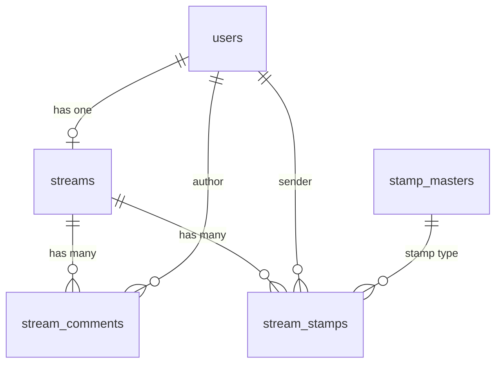
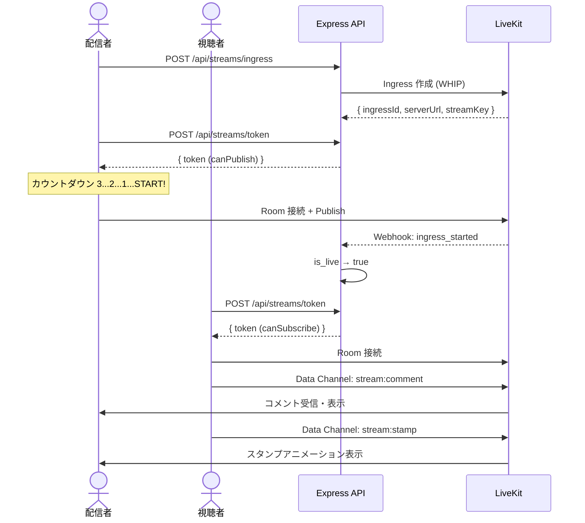

# 配信機能（1対多）設計書

## 目次

- [概要](#概要)
- [機能一覧](#機能一覧)
- [DB 設計](#db-設計)
  - [ER 図](#er-図)
  - [streams](#streams)
  - [stream_comments](#stream_comments)
  - [stream_stamps](#stream_stamps)
- [API 設計](#api-設計)
  - [REST API](#rest-api)
  - [LiveKit Data Channel イベント](#livekit-data-channel-イベント)
- [UI 設計](#ui-設計)
  - [画面一覧](#画面一覧)
  - [配信視聴ページ（/stream/:username）](#配信視聴ページstreamusername)
  - [配信者ダッシュボード（/dashboard/stream）](#配信者ダッシュボードdashboardstream)
  - [配信開始画面（/dashboard/stream/start）](#配信開始画面dashboardstreamstart)
- [仕様詳細](#仕様詳細)
  - [配信開始フロー](#配信開始フロー)
  - [視聴フロー](#視聴フロー)
  - [コメント機能](#コメント機能)
  - [スタンプ機能](#スタンプ機能)
  - [配信終了フロー](#配信終了フロー)
  - [配信設定管理](#配信設定管理)
- [LiveKit 連携詳細](#livekit-連携詳細)
  - [Ingress 設定](#ingress-設定)
  - [トークン権限](#トークン権限)
  - [Webhook 処理](#webhook-処理)
- [フロー図](#フロー図)
- [注意事項](#注意事項)

---

## 概要

1対多のライブ配信機能。配信者がブラウザのカメラ/マイクから直接配信し、視聴者がリアルタイムで視聴する。コメントとスタンプによる双方向インタラクションを提供。

**参加者構成**:
- 配信者: 1名（Publish 権限あり）
- 視聴者: N名（Subscribe + DataPublish のみ）

**LiveKit Room**: `stream:{userId}`

---

## 機能一覧

| 機能 | 詳細 |
|------|------|
| 配信開始 | ブラウザカメラ/マイクから WHIP で配信。将来的に OBS（RTMP）対応 |
| カウントダウン | 配信開始前に 3, 2, 1 のカウントダウン表示 |
| 視聴 | 配信中のストリームをリアルタイム視聴 |
| コメント | 視聴者がテキストコメントを送信。配信画面にリアルタイム表示 |
| スタンプ | 視聴者がスタンプを送信。配信者画面にフロートアニメーション表示 |
| 視聴者数 | 現在の視聴者数をリアルタイム表示 |
| 配信終了 | 配信者が手動で終了。視聴者に終了通知 |

---

## DB 設計

### ER 図



### streams

1ユーザーにつき1つの配信設定（1:1リレーション）。

| カラム | 型 | 制約 | 説明 |
|--------|------|------|------|
| id | int | PK, auto_increment | 配信ID |
| user_id | int | FK → users, unique, NOT NULL | 配信者（1ユーザー1配信） |
| title | varchar(255) | NOT NULL, default: "" | 配信タイトル |
| thumbnail_url | varchar(500) | nullable | サムネイル画像URL |
| ingress_id | varchar(255) | unique, nullable | LiveKit Ingress ID |
| server_url | varchar(500) | nullable | LiveKit RTMP/WHIP サーバーURL |
| stream_key | varchar(255) | nullable | 配信キー |
| is_live | boolean | NOT NULL, default: false | 配信中フラグ（Webhook で同期） |
| is_chat_enabled | boolean | NOT NULL, default: true | チャット有効フラグ |
| is_chat_delayed | boolean | NOT NULL, default: false | チャット遅延フラグ（3秒） |
| created_at | timestamp | NOT NULL | 作成日時 |
| updated_at | timestamp | NOT NULL | 更新日時 |

インデックス: `user_id`(unique), `is_live`, `ingress_id`(unique)

### stream_comments

リアルタイム表示は Data Channel。DB にはログとして非同期バッチ保存（10秒間隔）。

| カラム | 型 | 制約 | 説明 |
|--------|------|------|------|
| id | int | PK, auto_increment | コメントID |
| stream_id | int | FK → streams, NOT NULL | 配信ID |
| user_id | int | FK → users, NOT NULL | コメント投稿者 |
| body | text | NOT NULL | コメント本文 |
| created_at | timestamp | NOT NULL | 投稿日時 |

インデックス: `(stream_id, created_at)`

### stream_stamps

スタンプ送信ログ。非同期バッチ保存（5秒間隔）。

| カラム | 型 | 制約 | 説明 |
|--------|------|------|------|
| id | int | PK, auto_increment | スタンプログID |
| stream_id | int | FK → streams, NOT NULL | 配信ID |
| user_id | int | FK → users, NOT NULL | 送信者 |
| stamp_id | int | FK → stamp_masters, NOT NULL | スタンプ種別 |
| created_at | timestamp | NOT NULL | 送信日時 |

インデックス: `(stream_id, created_at)`

---

## API 設計

### REST API

| メソッド | パス | 認証 | 説明 |
|---------|------|------|------|
| GET | `/api/streams` | 不要 | 配信一覧を取得する。`is_live=true` を優先ソート。配信者情報を含む。カーソルページネーション対応 |
| GET | `/api/streams/:id` | 不要 | 配信の詳細情報（設定、配信者プロフィール、視聴者数）を取得する |
| POST | `/api/streams` | Access Token | 配信設定を新規作成する。通常はユーザー登録時に自動作成済み |
| PUT | `/api/streams/:id` | Access Token | 配信設定（title, thumbnail_url, is_chat_enabled, is_chat_delayed）を更新する。本人のみ |
| POST | `/api/streams/token` | Access Token | LiveKit トークンを生成する。配信者には Publish 権限付き、視聴者には Subscribe + DataPublish 権限付き |
| POST | `/api/streams/ingress` | Access Token | LiveKit Ingress（WHIP or RTMP）を作成する。本人のみ。Ingress ID / サーバーURL / 配信キーを返却 |
| GET | `/api/streams/:id/comments` | 不要 | コメント履歴を時系列で取得する（履歴閲覧用）。カーソルページネーション対応 |

### LiveKit Data Channel イベント

| イベント名 | 方向 | モード | 説明 |
|-----------|------|--------|------|
| `stream:comment` | 視聴者 → Room | Reliable | コメント送信。userId, userName, body, timestamp を含む |
| `stream:stamp` | 視聴者 → Room | Lossy | スタンプ送信。userId, stampId を含む。配信者画面にフロートアニメーション表示 |

---

## UI 設計

### 画面一覧

| パス | 画面名 | 認証 |
|------|--------|------|
| `/stream/:username` | 配信視聴ページ | 不要（コメント送信は要認証） |
| `/dashboard/stream` | 配信者ダッシュボード | 必要 |
| `/dashboard/stream/start` | 配信開始画面 | 必要 |

### 配信視聴ページ（/stream/:username）

`apps/web/src/app/stream/[username]/page.tsx`。AppShell では **immersive モード**（フルスクリーン、ナビバー・サイドバーなし）。

```
┌──────────────────────────────────────────────────────────┐
│ [Avatar] 配信者名 [LIVE]    [フォロー] [🔇] [⛶]         │ ← 上部オーバーレイ
│         👁 1,234 人視聴中                                 │
│                                                          │
│              （ビデオ全画面 + 中央プレースホルダ絵文字）    │
│              （上部・下部にグラデーション）                 │
│                                                          │
│                                                          │
│  ┌─ コメントオーバーレイ（VideoChatOverlay）─────────┐   │
│  │ UserA: こんにちは！                              │   │
│  │ UserB: すごい！                                  │   │
│  │ 🔥🔥🔥（受信スタンプフロート）                    │   │
│  │ [😀] [メッセージを送信...           ] [送信]     │   │
│  └─────────────────────────────────────────────────┘   │
└──────────────────────────────────────────────────────────┘
```

#### レイアウト

- **コンテナ**: `relative flex h-screen flex-col`
- **ビデオエリア**: 全画面 1 個。背景はサムネイル色のグラデーション（`bg-gradient-to-br {thumbnailColor}`）
  - 中央にプレースホルダ絵文字（`text-[120px] opacity-10`）
  - 上部に `bg-gradient-to-t from-dark-base/60 via-transparent to-transparent` のシェード
- **上部オーバーレイ** (`absolute left-0 right-0 top-0 flex items-center justify-between p-5`):
  - 左: アバター（40px 円形 + `ring-2 ring-white/20`）+ 配信者名（白 + ドロップシャドウ）+ `<LiveBadge>` + 視聴者数（`👁 {viewers.toLocaleString()} 人視聴中`）
  - 右: 「フォロー」ボタン（`bg-gradient-to-r from-primary to-primary-hover text-dark-base`）+ 各種コントロールアイコン（🔇, ⛶ など、半透明 blur 背景）
- **コメントオーバーレイ**: 画面下部全幅に `<VideoChatOverlay>`（[common/README.md](../common/README.md) 参照）を重ねる
  - スタンプ送信: 入力欄左の 😀 でスタンプパレット展開 → 絵文字をタップで Data Channel `stream:stamp` 送信
  - 受信スタンプはビデオ上にフロートアニメ（`<StampFloatLayer>`）

#### データ取得

- Server Component で `GET /api/streams?username={username}` または `GET /api/users/{username}/stream` を呼び出し、配信者と is_live を取得
- `is_live = true` の場合: `POST /api/streams/token` で視聴者トークンを生成 → クライアントで LiveKit Room 接続
- `is_live = false` の場合: 「配信は現在オフラインです」のオフライン画面を表示

### 配信者ダッシュボード（/dashboard/stream）

- 配信設定カード（タイトル、サムネイル）
- 配信キーカード（サーバーURL、キー伏せ字表示、リセット）
- チャット設定カード（有効/無効、遅延モード）
- 配信プレビュー + 「配信開始」ボタン

### 配信開始画面（/dashboard/stream/start）

フルスクリーン。カメラ許可 → プレビュー → 「配信開始」 → カウントダウン → 配信中画面

---

## 仕様詳細

### 配信開始フロー

1. `/dashboard/stream/start` にアクセス → カメラ/マイク許可要求
2. プレビュー画面（自分の映像 + マイクレベルメーター）
3. 「配信開始」クリック → Ingress 作成（未作成時）+ トークン生成（canPublish）
4. **カウントダウン**（3, 2, 1, START!）
5. LiveKit Room 接続 → カメラ/マイクトラック Publish
6. Webhook `ingress_started` → `is_live` = true

### 視聴フロー

1. `/stream/:username` アクセス → Server Component で配信情報取得
2. `is_live = true`: 視聴者トークン生成（canSubscribe + canPublishData）→ Room 接続
3. `is_live = false`: オフライン画面表示

### コメント機能

- Data Channel（Reliable）で送受信。ユーザー名色分け表示（string-to-color）
- 制約: 1〜500文字、レート制限1秒1回、`is_chat_enabled=false` 時は入力欄非表示
- `is_chat_delayed=true` 時はメッセージ表示を3秒遅延

### スタンプ機能

- Data Channel（Lossy）で送受信。ビデオ上にフロートアニメーション
- 制約: レート制限1秒3回（クライアントスロットル）、同時表示上限30個

### 配信終了フロー

1. 「配信終了」クリック → 確認ダイアログ
2. LiveKit Room 切断 → Webhook `ingress_ended` → `is_live` = false
3. 視聴者側: 「配信が終了しました」画面に切り替え

### 配信設定管理

| 設定項目 | 説明 | デフォルト |
|---------|------|-----------|
| タイトル | 1〜100文字 | 空文字 |
| サムネイル | S3 アップロード | なし |
| チャット有効 | ON/OFF | ON |
| チャット遅延 | 3秒遅延 | OFF |

---

## LiveKit 連携詳細

### Ingress 設定

初期リリースは **WHIP**（ブラウザ直接配信）。将来的に **RTMP**（OBS）を追加。

### トークン権限

| 対象 | canPublish | canSubscribe | canPublishData | identity |
|------|-----------|-------------|---------------|----------|
| 配信者 | ✓ | ✓ | ✓ | `host-{userId}` |
| 視聴者（ログイン済み） | ✕ | ✓ | ✓ | `viewer-{userId}` |
| 視聴者（未ログイン） | ✕ | ✓ | ✕ | `guest-{uuid}` |

### Webhook 処理

| イベント | 処理 |
|---------|------|
| `ingress_started` | `streams.is_live` → `true` |
| `ingress_ended` | `streams.is_live` → `false` |

---

## フロー図



---

## 注意事項

### セキュリティ
- 視聴者には canPublish を絶対に付与しない
- 配信キーは API レスポンスで配信者本人にのみ返却
- ブロック済みユーザーのトークン生成を拒否

### パフォーマンス
- コメント・スタンプの DB 保存は非同期バッチ
- 視聴者数は LiveKit Room 参加者数から取得（DB 不要）
- スタンプアニメーションは CSS Transform + GPU アクセラレーション
